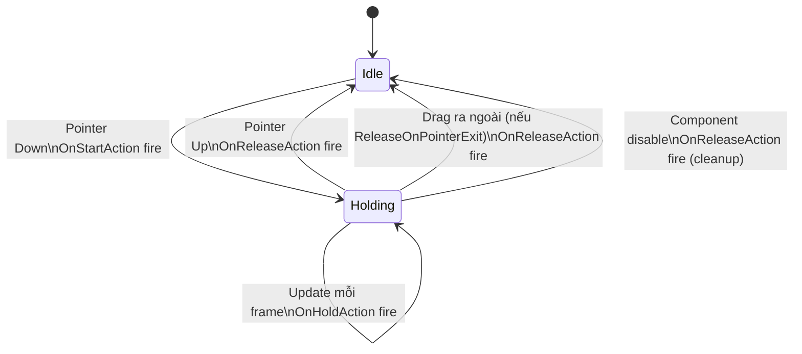
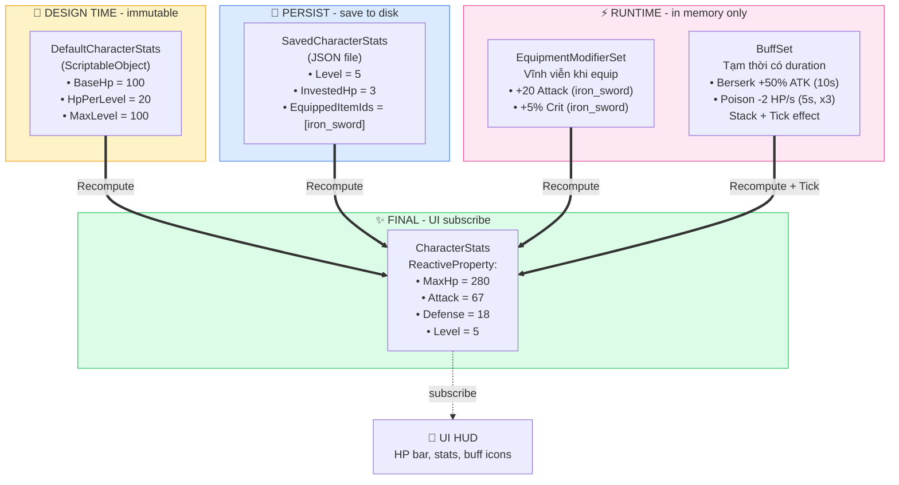
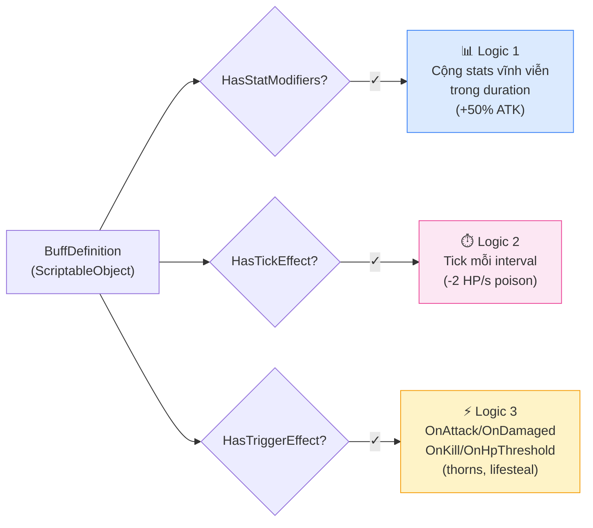
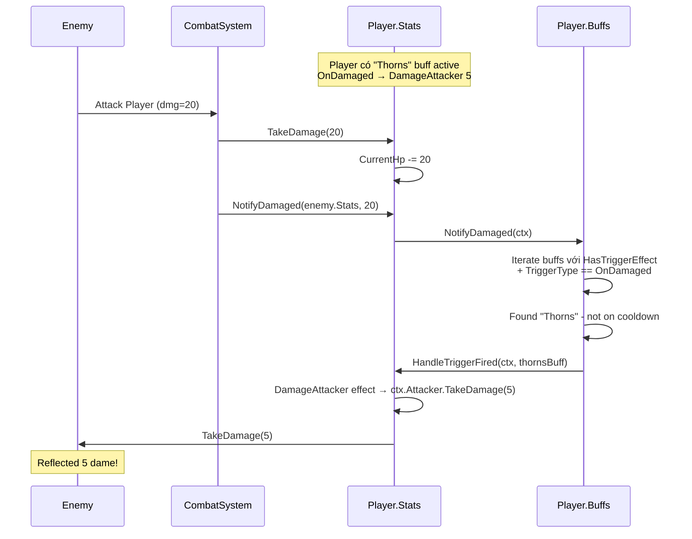
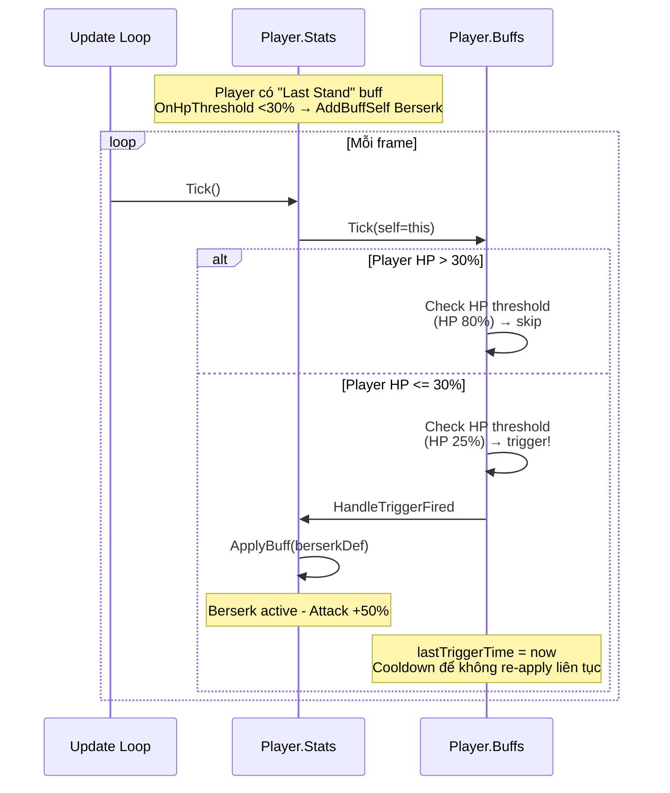

# Cookbook - "Muốn làm X thì làm sao"

Đây là tập hợp các công thức nhỏ. Tìm vấn đề bạn đang gặp → copy code → chạy.

**Quy ước:** Mọi recipe dưới đây giả định bạn đang viết trong file `.cs` mới trong folder `Assets/_Project/Scripts/Gameplay/`.

---

## Mục lục

**Đọc đầu tiên:**
0. [Folder Structure - đặt assets vào đâu?](#0-folder-structure---đặt-assets-vào-đâu)

**Cơ bản (mới vào dự án):**
1. [Lấy AudioManager để phát SFX](#1-lấy-audiomanager-để-phát-sfx)
2. [Phát nhạc nền](#2-phát-nhạc-nền)
   - [2b. Bật/tắt âm thanh (mute on/off)](#2b-bậttắt-âm-thanh-mute-onoff---không-cần-slider-volume)
   - [2c. Settings panel với slider volume + toggle](#2c-settings-panel-với-slider-volume--toggle)
3. [Load scene mới](#3-load-scene-mới)
4. [Lưu/đọc dữ liệu player](#4-lưuđọc-dữ-liệu-player)
   - [4b. Check ngày mới (Daily Reset / Login Bonus)](#4b-check-ngày-mới-daily-reset--login-bonus)
   - [4c. Tutorial system (Step Sequencer + Highlight)](#4c-tutorial-system-step-sequencer--highlight)
5. [Hiện/ẩn UI panel](#5-hiệnẩn-ui-panel)
   - [5b. Tạo UI an toàn với notch / home indicator (Safe Area)](#5b-tạo-ui-an-toàn-với-notch--home-indicator-safe-area)
   - [5c. Camera fit gameplay area trên mọi device aspect](#5c-camera-fit-gameplay-area-trên-mọi-device-aspect)
   - [5d. EnhancedButton - Button có SFX + Analytics + Haptic](#5d-enhancedbutton---button-có-sfx--analytics--haptic)
   - [5e. HoldButton - Nút nhấn giữ với UnityEvent](#5e-holdbutton---nút-nhấn-giữ-với-unityevent)
6. [In log debug](#6-in-log-debug)

**Event Bus - giao tiếp giữa các module:**
1. [#7 Tạo event mới](#7-tạo-event-mới)
2. [#8 Publish event](#8-publish-event)
3. [#9 Subscribe event](#9-subscribe-event)
4. [#10 Anti-pattern: quên Unsubscribe](#10-anti-pattern-quên-unsubscribe)

**Reactive UI - tự động update khi data đổi:**
1. [#11 HP/Score tự update lên UI](#11-hpscore-tự-update-lên-ui)
   - [Phiên bản đơn giản (cho casual/puzzle game)](#phiên-bản-đơn-giản-cho-casualpuzzle-game)
   - [Phiên bản đầy đủ (cho RPG/Adventure) - 4 lớp data tách biệt](#phiên-bản-đầy-đủ-cho-rpgadventure---4-lớp-data-tách-biệt)
2. [#12 Inventory tự refresh khi add/remove item](#12-inventory-tự-refresh-khi-addremove-item)

**Mobile services:**
1. [#13 Hiện banner ads](#13-hiện-banner-ads)
2. [#14 Show rewarded video](#14-show-rewarded-video)
3. [#15 Tắt ads khi user mua Remove Ads](#15-tắt-ads-khi-user-mua-remove-ads)
4. [#16 Mua in-app purchase](#16-mua-in-app-purchase)
5. [#17 Track event Firebase Analytics](#17-track-event-firebase-analytics)
6. [#18 Đổi ngôn ngữ](#18-đổi-ngôn-ngữ)
7. [#19 Rung khi tap button](#19-rung-khi-tap-button)
8. [#20 Đọc Remote Config từ Firebase](#20-đọc-remote-config-từ-firebase)

**Spawn objects:**
1. [#21 Pool object để spawn enemy](#21-pool-object-để-spawn-enemy)
   - [21b. IPoolable - object tự reset state khi spawn/despawn](#21b-ipoolable---object-tự-reset-state-khi-spawnđespawn)
2. [#22 Factory: spawn enemy từ ScriptableObject](#22-factory-spawn-enemy-từ-scriptableobject)

**Async (chain animation):**
1. [#23 Delay không dùng coroutine](#23-delay-không-dùng-coroutine)
2. [#24 Fade in UI rồi đợi 2s rồi fade out](#24-fade-in-ui-rồi-đợi-2s-rồi-fade-out)
3. [#25 Đợi đến khi player chạm điểm](#25-đợi-đến-khi-player-chạm-điểm)
4. [#25b Lặp lại action định kỳ (thay thế InvokeRepeating)](#25b-lặp-lại-action-định-kỳ-thay-thế-invokerepeating)

**Debug & dev:**
1. [#26 Thêm cheat command (god mode, add coin)](#26-thêm-cheat-command-god-mode-add-coin)
2. [#27 Mở Cheat Console trong build](#27-mở-cheat-console-trong-build)
3. [#28 Bật log dev](#28-bật-log-dev)
4. [#28b Hiện FPS counter khi test trên device](#28b-hiện-fps-counter-khi-test-trên-device)
5. [#28c Fix Unity 6 import ảnh tự động thành Multiple](#28c-fix-unity-6-import-ảnh-tự-động-thành-multiple)

**Common gotchas:**
1. [#29 Lỗi "Cannot Add Component"](#29-lỗi-cannot-add-component)
2. [#30 Lỗi "Service chưa được register"](#30-lỗi-service-chưa-được-register)

---

## 0. Folder Structure - đặt assets vào đâu?

Đây là cấu trúc folder **template recommend**. Mọi recipe khác trong Cookbook giả định cấu trúc này tồn tại.

### Tree structure

```
Assets/
├── _Project/                    ← Folder chứa MỌI assets do team tạo
│   ├── Art/                     ← Hình ảnh, sprite, texture
│   │   ├── UI/                  ← Icon, button, panel (Single, no mipmap)
│   │   │   ├── Icons/
│   │   │   ├── Buttons/
│   │   │   └── Panels/
│   │   ├── Sprites/             ← Gameplay sprite đơn (Single, mipmap on)
│   │   │   ├── Characters/
│   │   │   ├── Enemies/
│   │   │   └── Items/
│   │   ├── SpriteSheets/        ← Animation sheet (Multiple, có slice)
│   │   │   ├── Player/
│   │   │   └── Enemies/
│   │   ├── Animations/          ← Sprite atlas animation (Multiple)
│   │   ├── Atlases/             ← Sprite Atlas pre-packed (Multiple)
│   │   ├── Backgrounds/         ← Background lớn (Single, no mipmap)
│   │   └── Splash/              ← Splash screen (Single, no mipmap)
│   │
│   ├── Audio/                   ← Music, SFX, voice
│   │   ├── Music/
│   │   ├── SFX/
│   │   │   ├── UI/              ← Button click, popup, notification
│   │   │   └── Gameplay/        ← Hit, explosion, footstep
│   │   └── Voice/               ← Dialogue, narration (optional)
│   │
│   ├── Scenes/                  ← Unity scenes
│   │   ├── Bootstrap.unity      ← Scene 0 - init services
│   │   ├── MainMenu.unity       ← Scene 1 - main menu
│   │   └── Gameplay.unity       ← Scene 2 - gameplay
│   │
│   ├── Prefabs/                 ← Reusable GameObjects
│   │   ├── UI/                  ← Panel, popup, HUD prefabs
│   │   ├── Characters/          ← Player, Enemy prefabs
│   │   ├── VFX/                 ← Particle, effect prefabs
│   │   └── Items/               ← Pickup, equipment prefabs
│   │
│   ├── Settings/                ← ScriptableObject configs
│   │   ├── Audio/               ← AudioMixerSettings
│   │   ├── Localization/        ← LocalizationTable
│   │   ├── Stats/               ← DefaultCharacterStats, EquipmentItem, BuffDefinition
│   │   └── Game/                ← Game balance configs
│   │
│   ├── Resources/               ← Assets load qua Resources.Load (hạn chế dùng!)
│   ├── StreamingAssets/         ← Files copy nguyên trạng vào build
│   │
│   └── Scripts/                 ← Code C#
│       ├── Core/                ← Framework reusable cho mọi project
│       │   ├── Bootstrap/
│       │   ├── DI/
│       │   ├── Events/
│       │   ├── UI/
│       │   ├── Camera/
│       │   ├── Audio/
│       │   ├── Save/
│       │   ├── SceneManagement/
│       │   ├── Pooling/
│       │   ├── Logger/
│       │   ├── Utils/
│       │   ├── DevTools/
│       │   ├── Patterns/
│       │   │   ├── Reactive/
│       │   │   ├── Factory/
│       │   │   ├── MVP/
│       │   │   ├── Singleton/
│       │   │   ├── Async/
│       │   │   └── Attributes/
│       │   └── Mobile/
│       │       ├── Ads/
│       │       ├── IAP/
│       │       ├── Analytics/
│       │       ├── RemoteConfig/
│       │       ├── Localization/
│       │       ├── Haptic/
│       │       └── Device/
│       ├── Gameplay/            ← Code game-specific (project này)
│       │   ├── Core/
│       │   ├── Stats/
│       │   └── UI/
│       └── Editor/              ← Editor tools (chỉ chạy trong Editor)
│           ├── Infrastructure/
│           ├── QualityOfLife/
│           ├── AssetWorkflow/
│           └── MetaTools/
│
├── ThirdParty/                  ← Plugin từ Asset Store, SDK ngoài
│   ├── DOTween/
│   ├── AppLovin/
│   └── Firebase/
│
└── Plugins/                     ← Native plugin (Android/iOS)
```

### Quy tắc đặt tên

**Folder root tên `_Project/` (có dấu `_` đầu)?** Để folder team **luôn nằm trên đầu** trong Project window (sort alphabetical). Tách biệt rõ với folder của asset store/SDK ngoài.

| Convention | Vì sao |
|---|---|
| Folder code: PascalCase (`Bootstrap/`, `DI/`) | Khớp namespace C# |
| Folder asset: PascalCase (`Sprites/`, `Backgrounds/`) | Đồng nhất với code |
| File scene: PascalCase (`MainMenu.unity`) | Khớp tên class controller |
| File prefab: PascalCase (`PlayerCharacter.prefab`) | Khớp tên prefab GameObject |
| ScriptableObject asset: PascalCase + suffix loại (`DefaultStats_Warrior.asset`, `Buff_Berserk.asset`) | Dễ filter trong Project search |

### Quy tắc đặt assets vào folder nào

| Loại asset | Folder | Vì sao |
|---|---|---|
| Icon button (16x16, 32x32) | `Art/UI/Icons/` | Single mode, no mipmap |
| Button background | `Art/UI/Buttons/` | Single mode |
| Popup panel background | `Art/UI/Panels/` | Single mode |
| Character idle sprite (1 ảnh) | `Art/Sprites/Characters/` | Single mode, có mipmap (gameplay sprite có thể zoom) |
| Character walk animation (8 frame trong 1 ảnh) | `Art/SpriteSheets/Player/` | Multiple mode, slice grid |
| Background level 1080x1920 | `Art/Backgrounds/` | Single, no mipmap (tiết kiệm 33% memory) |
| Splash screen logo | `Art/Splash/` | Single, no mipmap |
| Particle texture (smoke, flare) | `Art/Sprites/` | Single, mipmap on |
| Music background (3-5 phút) | `Audio/Music/` | Compress Vorbis quality 60-70 |
| Button click SFX | `Audio/SFX/UI/` | Compress ADPCM hoặc PCM (ngắn, cần phát ngay) |
| Hit/explosion SFX | `Audio/SFX/Gameplay/` | Compress Vorbis quality 70-80 |
| Voice line dialogue | `Audio/Voice/` | Vorbis quality 50-60 (low cho mobile) |
| Player prefab | `Prefabs/Characters/` | |
| Bullet, projectile prefab | `Prefabs/Items/` | |
| Explosion VFX prefab | `Prefabs/VFX/` | |
| Settings panel prefab | `Prefabs/UI/` | |
| AudioMixer settings | `Settings/Audio/` | |
| Game balance (max HP, drop rate) | `Settings/Game/` | |
| ScriptableObject character class | `Settings/Stats/` | DefaultStats_Warrior, Mage... |
| BuffDefinition asset | `Settings/Stats/` | Buff_Berserk, Buff_Poison... |
| Item asset | `Settings/Stats/` | Item_IronSword, Item_PlateArmor... |

### Quy tắc `Resources/` - hạn chế dùng!

**`Resources/` folder** load asset qua `Resources.Load("path")`. Nghe tiện nhưng có **2 vấn đề lớn**:

1. **Memory:** mọi assets trong `Resources/` đều **load vào memory khi game start** (Unity build vào 1 archive). Game 100 sprite trong Resources → load hết, tốn RAM, kéo dài startup.
2. **Không strip:** asset trong Resources **không bị strip** dù không dùng → build bloat.

**Recommend:**
- ✅ Asset **luôn cần** (vd: missing icon placeholder, default font) → Resources OK
- ✅ Asset cần load runtime không qua reference (vd: cheat console list assets) → Resources OK
- ❌ UI icon, character sprite, music track → đặt trong `Art/`, `Audio/` và reference qua `[SerializeField]` hoặc Addressables

### Quy tắc `StreamingAssets/`

Files trong `StreamingAssets/` được **copy nguyên trạng** vào build (không qua AssetBundle/compression).

**Use case:**
- File config JSON edit được bởi QA team
- Video tutorial (`.mp4` Unity không hỗ trợ trực tiếp qua import)
- Database SQLite có sẵn

**Đường dẫn runtime:**
```csharp
string path = Path.Combine(Application.streamingAssetsPath, "config.json");
// Android: phải dùng UnityWebRequest (file nằm trong APK)
// iOS, PC: dùng File.ReadAllText được trực tiếp
```

### Quy tắc separation Code

**`Scripts/Core/`** - Framework code:
- Tái sử dụng cho project khác (mobile template)
- Không reference Gameplay (không biết game đang làm là gì)
- Có asmdef riêng: `GameTemplate.Core`

**`Scripts/Gameplay/`** - Game-specific code:
- Project hiện tại (vd: RPG này)
- Có thể reference Core
- Có asmdef riêng: `GameTemplate.Gameplay`

**`Scripts/Editor/`** - Editor tools:
- Chỉ build vào Editor, KHÔNG vào game release
- Có asmdef Editor-only: `GameTemplate.Editor`

→ 3 asmdef tách biệt giúp compile nhanh, không "1 file đổi → toàn bộ project recompile".

### Quy tắc `ThirdParty/`

Mọi plugin từ Asset Store hoặc SDK ngoài đặt ở `Assets/ThirdParty/` (KHÔNG để trong `_Project/`):

- `ThirdParty/DOTween/` - animation library
- `ThirdParty/AppLovin/` - ads SDK
- `ThirdParty/Firebase/` - Firebase SDK

**Tại sao tách?**
- Update plugin = xoá folder + import lại - không sợ delete code của team
- Search code trong `_Project/` không bị nhiễu bởi plugin
- Reset project về initial state = xoá `ThirdParty/` + import lại từ store

### Setup project mới - checklist

1. ✅ Tạo `Assets/_Project/` folder
2. ✅ Tạo các subfolder theo tree ở trên (chỉ tạo folder bạn sẽ dùng - không cần tạo hết)
3. ✅ Import template `Assets/_Project/Scripts/` (Core + Gameplay + Editor)
4. ✅ Tạo `Assets/ThirdParty/` cho plugin
5. ✅ Add `.gitignore` chuẩn Unity (đã có trong template)
6. ✅ Setup 3 asmdef (`Core`, `Gameplay`, `Editor`) - đã có sẵn trong template

### Common pitfalls

**Pitfall 1: Asset đặt sai folder → `SpriteImportPostprocessor` không apply đúng**

Vd: kéo button vào `Art/Sprites/` thay vì `Art/UI/Buttons/` → button có mipmap (tốn memory).

**Fix:** đặt đúng folder theo bảng ở trên, hoặc tự custom convention trong `SpriteImportPostprocessor.cs`.

**Pitfall 2: Folder name có dấu cách hoặc tiếng Việt**

Vd: `Art/Nhân vật/` → Unity hoạt động bình thường nhưng:
- Build trên Android/iOS có thể fail (path encoding)
- Code reference path string sẽ rối

**Fix:** chỉ dùng English ASCII, PascalCase.

**Pitfall 3: Trộn lẫn code team với plugin trong `_Project/`**

Vd: import DOTween vào `_Project/Scripts/DOTween/` → khi update DOTween phải merge thủ công, dễ lỗi.

**Fix:** plugin LUÔN đặt trong `ThirdParty/` riêng biệt.

**Pitfall 4: ScriptableObject asset đặt cùng folder với code**

Vd: `Scripts/Stats/Buff_Berserk.asset` → khó tìm khi search.

**Fix:** code trong `Scripts/`, data assets trong `Settings/` hoặc `Art/`.

---

## 1. Lấy AudioManager để phát SFX

```csharp
using UnityEngine;
using GameTemplate.Core.DI;
using GameTemplate.Core.Audio;

public class CoinPickup : MonoBehaviour
{
    [SerializeField] private AudioClip _pickupSound;

    private void OnTriggerEnter(Collider other)
    {
        if (other.CompareTag("Player"))
        {
            // Lấy AudioManager từ ServiceLocator (đã register sẵn trong Bootstrap)
            var audio = ServiceLocator.Get<IAudioService>();
            audio.PlaySfx(_pickupSound);

            Destroy(gameObject);
        }
    }
}
```

**Tại sao không `audio.PlayOneShot()`?** Vì cách này dùng pool AudioSource sẵn, không tạo AudioSource mới mỗi lần (tránh GC spike trên mobile).

---

## 2. Phát nhạc nền

```csharp
using GameTemplate.Core.DI;
using GameTemplate.Core.Audio;
using UnityEngine;

public class MainMenuMusic : MonoBehaviour
{
    [SerializeField] private AudioClip _menuMusic;

    private void Start()
    {
        ServiceLocator.Get<IAudioService>().PlayMusic(_menuMusic, loop: true, fadeIn: 1f);
    }
}
```

**Để dừng nhạc khi vào gameplay:**
```csharp
ServiceLocator.Get<IAudioService>().StopMusic(fadeOut: 0.5f);
```

---

## 2b. Bật/tắt âm thanh (mute on/off) - không cần slider volume

Nhiều game (hyper-casual, puzzle) chỉ cần icon 🔊/🔇 chứ không cần slider chi tiết. Template có sẵn API mute độc lập, tự lưu PlayerPrefs:

```csharp
using GameTemplate.Core.DI;
using GameTemplate.Core.Audio;
using UnityEngine;
using UnityEngine.UI;

public class SoundToggleButton : MonoBehaviour
{
    [SerializeField] private Image _icon;
    [SerializeField] private Sprite _iconOn;
    [SerializeField] private Sprite _iconOff;

    private IAudioService _audio;

    private void Start()
    {
        _audio = ServiceLocator.Get<IAudioService>();
        RefreshIcon();

        // Subscribe để icon tự update khi setting đổi từ chỗ khác
        _audio.OnAudioSettingsChanged += RefreshIcon;
    }

    private void OnDestroy()
    {
        if (_audio != null)
            _audio.OnAudioSettingsChanged -= RefreshIcon;
    }

    // Gọi từ Button OnClick trong Inspector
    public void OnClick()
    {
        _audio.ToggleMaster(); // toggle on/off, tự save PlayerPrefs
    }

    private void RefreshIcon()
    {
        _icon.sprite = _audio.IsMasterMuted ? _iconOff : _iconOn;
    }
}
```

**Tắt riêng music hoặc SFX:**
```csharp
audio.IsMusicMuted = true;  // chỉ tắt nhạc, SFX vẫn nghe được
audio.IsSfxMuted = true;    // chỉ tắt SFX, nhạc vẫn chạy
audio.ToggleMusic();        // shortcut toggle
```

**Auto persist:** Mọi thay đổi tự lưu PlayerPrefs. Player reload game → setting giữ nguyên.

---

## 2c. Settings panel với slider volume + toggle

Khi cần cả 2: slider volume và nút mute (vd RPG settings menu):

```csharp
using GameTemplate.Core.DI;
using GameTemplate.Core.Audio;
using UnityEngine;
using UnityEngine.UI;

public class AudioSettingsPanel : MonoBehaviour
{
    [Header("Sliders")]
    [SerializeField] private Slider _masterSlider;
    [SerializeField] private Slider _musicSlider;
    [SerializeField] private Slider _sfxSlider;

    [Header("Mute Toggles")]
    [SerializeField] private Toggle _masterToggle;
    [SerializeField] private Toggle _musicToggle;
    [SerializeField] private Toggle _sfxToggle;

    private IAudioService _audio;

    private void Start()
    {
        _audio = ServiceLocator.Get<IAudioService>();

        // Init UI từ saved settings
        _masterSlider.value = _audio.MasterVolume;
        _musicSlider.value = _audio.MusicVolume;
        _sfxSlider.value = _audio.SfxVolume;
        _masterToggle.isOn = !_audio.IsMasterMuted; // Toggle ON = không mute
        _musicToggle.isOn = !_audio.IsMusicMuted;
        _sfxToggle.isOn = !_audio.IsSfxMuted;

        // Listen UI changes -> update audio (audio tự save PlayerPrefs)
        _masterSlider.onValueChanged.AddListener(v => _audio.MasterVolume = v);
        _musicSlider.onValueChanged.AddListener(v => _audio.MusicVolume = v);
        _sfxSlider.onValueChanged.AddListener(v => _audio.SfxVolume = v);
        _masterToggle.onValueChanged.AddListener(on => _audio.IsMasterMuted = !on);
        _musicToggle.onValueChanged.AddListener(on => _audio.IsMusicMuted = !on);
        _sfxToggle.onValueChanged.AddListener(on => _audio.IsSfxMuted = !on);
    }
}
```

**Lưu ý:** Mute và Volume độc lập. User mute nhạc → unmute lại nhạc đúng volume cũ (không reset về 0).

---

## 3. Load scene mới

```csharp
using UnityEngine;
using UnityEngine.UI;
using GameTemplate.Core.DI;
using GameTemplate.Core.SceneManagement;

public class PlayButton : MonoBehaviour
{
    [SerializeField] private Button _button;

    private void Start()
    {
        _button.onClick.AddListener(OnPlay);
    }

    private async void OnPlay()
    {
        var loader = ServiceLocator.Get<ISceneLoader>();
        await loader.LoadSceneAsync("Gameplay");
        // Code sau dòng này chạy SAU khi scene đã load xong
    }
}
```

**Lưu ý:** Scene "Gameplay" phải được thêm vào Build Settings (File → Build Settings → drag scene vào).

---

## 4. Lưu/đọc dữ liệu player

**Bước 1: Định nghĩa class data**

```csharp
using System;
using GameTemplate.Core.Save;

[Serializable]
public class PlayerData : SaveDataBase
{
    public int Coins;
    public int HighScore;
    public int CurrentLevel;
    public string PlayerName;
}
```

**Bước 2: Load và save**

```csharp
using GameTemplate.Core.DI;
using GameTemplate.Core.Save;
using UnityEngine;

public class PlayerProgress : MonoBehaviour
{
    private PlayerData _data;
    private ISaveService _save;

    private async void Start()
    {
        _save = ServiceLocator.Get<ISaveService>();
        _data = await _save.LoadAsync<PlayerData>("player");
        Debug.Log($"Loaded: coins={_data.Coins}, level={_data.CurrentLevel}");
    }

    public async void AddCoins(int amount)
    {
        _data.Coins += amount;
        await _save.SaveAsync("player", _data);
    }
}
```

File save được lưu tự động vào `Application.persistentDataPath/Saves/player.json`. Trên Editor mở folder qua menu: **GameTemplate → Folder → Persistent Data Path**.

---

## 4b. Check ngày mới (Daily Reset / Login Bonus)

Cho daily reward, daily quest, free chest mỗi ngày, reset số ad watch hàng ngày...

### Triết lý thiết kế

Template chỉ làm phần **universal**:
- ✅ Check "đã sang ngày mới chưa"
- ✅ Lưu lần claim cuối + streak
- ✅ Time đến lần reset tiếp theo (cho countdown UI)

Không làm phần **game-specific**:
- ❌ UI claim reward (mỗi game khác)
- ❌ Reward data (RPG có gem/equipment, casual có coin/skin)
- ❌ Apply reward vào inventory/wallet

→ Mỗi game tự build LoginBonusController riêng, gọi service này check ngày.

### Cách dùng

```csharp
using GameTemplate.Core.DI;
using GameTemplate.Core.Scheduling;

public class LoginBonusController : MonoBehaviour
{
    [SerializeField] private LoginBonusPanel _panel;
    [SerializeField] private RewardData[] _rewards; // 7 ngày streak

    private IDailyResetService _daily;

    private void Start()
    {
        _daily = ServiceLocator.Get<IDailyResetService>();

        if (_daily.IsNewDay("login_bonus"))
        {
            ShowClaimUI();
        }
    }

    private void ShowClaimUI()
    {
        int currentStreak = _daily.GetStreakIfClaimed("login_bonus");
        int dayToShow = (currentStreak % 7) + 1; // ngày 1-7 lặp lại

        _panel.Show(_rewards[dayToShow - 1], dayToShow);
    }

    public void OnClaimButtonClicked()
    {
        int currentStreak = _daily.GetStreakIfClaimed("login_bonus");
        var reward = _rewards[currentStreak % 7];

        // Apply reward - game tự handle
        _playerWallet.AddCoins(reward.Coins);
        _playerInventory.AddItem(reward.ItemId);

        // Đánh dấu đã claim
        _daily.MarkAsClaimed("login_bonus");

        _panel.Hide();
    }
}
```

### Multi-key (nhiều daily reset độc lập)

1 service quản nhiều daily key:

```csharp
// Login bonus
if (_daily.IsNewDay("login_bonus")) ShowLoginBonus();

// Daily quest
if (_daily.IsNewDay("daily_quest")) GenerateNewQuests();

// Free chest mỗi ngày
if (_daily.IsNewDay("free_chest")) UnlockFreeChest();

// Reset số ad watch hàng ngày (vd: max 10 ads/ngày)
if (_daily.IsNewDay("ad_limit"))
{
    PlayerPrefs.SetInt("ads_watched_today", 0);
    _daily.MarkAsClaimed("ad_limit");
}
```

Mỗi key có streak + timestamp riêng, không ảnh hưởng nhau.

### Countdown UI

Hiện "Next reward in 03:25:10":

```csharp
public class CountdownText : MonoBehaviour
{
    [SerializeField] private Text _text;
    private IDailyResetService _daily;

    private void Start() => _daily = ServiceLocator.Get<IDailyResetService>();

    private void Update()
    {
        var remaining = _daily.GetTimeUntilNextReset();
        _text.text = $"Next in {remaining:hh\\:mm\\:ss}";
    }
}
```

### Streak logic

| Hành động | Streak |
|---|---|
| Lần claim đầu tiên | 1 |
| Claim ngày hôm sau (liên tiếp) | +1 |
| Claim cùng ngày 2 lần | (không tăng, log warning) |
| Bỏ ≥1 ngày rồi claim | Reset về 1 |

Logic này phù hợp với daily login bonus chuẩn: streak chỉ tăng khi liên tiếp.

### Bảo mật: chấp nhận hack hay chống hack?

**Service mặc định dùng `DateTime.Now`** (device time) - **user chỉnh đồng hồ điện thoại có thể hack** để claim nhiều lần.

| Approach | Pros | Cons | Khi nào dùng |
|---|---|---|---|
| **Device time** (default) | Đơn giản, không cần network | User chỉnh thời gian = hack được | Casual game, free-to-play, ít tranh chấp |
| **NTP time** (Google/Apple time server) | Khó hack hơn | Cần network, có latency | Game cạnh tranh nhưng không backend |
| **Server time** | Không hack được | Cần backend, cost | Game competitive, MMO, ranked |

**Bonus:** chống hack đơn giản bằng "thời gian chỉ tiến không lùi":

```csharp
public void MarkAsClaimed(string key)
{
    var now = DateTime.Now;
    var lastClaim = GetLastClaimDate(key);

    // Anti-cheat: nếu now < lastClaim → user đã lùi đồng hồ
    if (lastClaim != DateTime.MinValue && now < lastClaim)
    {
        GameLog.Warning(LogCategory.Save,
            $"[Anti-cheat] Detected time rollback for '{key}' - skip claim.");
        // Optional: log Analytics để track tỷ lệ hack
        return;
    }
    // ... normal logic
}
```

Service hiện tại chưa có check này - bạn tự thêm nếu cần.

### Cheat command (cho QA testing)

```csharp
[CheatCommand("reset_daily", "Reset daily login key. Usage: reset_daily login_bonus")]
static void ResetDaily(string[] args)
{
    if (args.Length == 0) return;
    var daily = ServiceLocator.Get<IDailyResetService>();
    daily.ResetKey(args[0]);
    Debug.Log($"Reset daily key: {args[0]}");
}

[CheatCommand("daily_info", "Print all daily info")]
static void DailyInfo(string[] args)
{
    var daily = ServiceLocator.Get<IDailyResetService>();
    var keys = new[] { "login_bonus", "daily_quest", "free_chest" };
    foreach (var key in keys)
    {
        Debug.Log($"{key}: " +
            $"IsNewDay={daily.IsNewDay(key)}, " +
            $"Streak={daily.GetStreakIfClaimed(key)}, " +
            $"LastClaim={daily.GetLastClaimDate(key):yyyy-MM-dd}");
    }
}
```

### Common pitfalls

**Pitfall 1: So sánh DateTime với `==` thay vì `.Date`**

```csharp
// SAI: DateTime.Now luôn có giờ phút giây → never equal
if (lastClaim == DateTime.Now) ...

// ĐÚNG: chỉ so date
if (lastClaim.Date == DateTime.Now.Date) ...
```

Service đã handle đúng - bạn không phải lo, nhưng nhớ pattern này khi tự viết logic time.

**Pitfall 2: Không persist sau MarkAsClaimed**

PlayerPrefs cần `PlayerPrefs.Save()` để flush. Service đã gọi sẵn.

**Pitfall 3: Quên reset cheat sau test**

Sau khi QA test daily, nhớ clear PlayerPrefs để dev khác không bị stuck ở streak cũ:

```csharp
[CheatCommand("clear_all_daily", "Clear all daily PlayerPrefs")]
static void ClearAll(string[] args)
{
    var daily = ServiceLocator.Get<IDailyResetService>();
    daily.ResetKey("login_bonus");
    daily.ResetKey("daily_quest");
    daily.ResetKey("free_chest");
}
```

**Pitfall 4: Streak qua thiết bị khác**

PlayerPrefs lưu cục bộ device. Nếu user đổi máy → streak reset về 0.

Fix (nếu cần sync): lưu streak vào cloud save (Google Play Games / iCloud / backend server).

---

## 4c. Tutorial system (Step Sequencer + Highlight)

### Triết lý thiết kế

Tutorial mỗi game khác nhau hoàn toàn về nội dung. Template tách:

**Phần dùng lại (engine):**
- ✅ Chạy tuần tự các bước
- ✅ Lưu tiến độ (đã học bước nào → lần sau không chạy lại)
- ✅ Chờ điều kiện hoàn thành
- ✅ Highlight UI + mask tối + block input ngoài vùng cho phép
- ✅ Text bubble hướng dẫn
- ✅ Skip / resume

**Phần game-specific (game tự viết):**
- ❌ Bước này dạy gì
- ❌ Highlight element nào
- ❌ Điều kiện complete cụ thể

→ KHÔNG dùng data-driven (ScriptableObject) vì điều kiện game-specific cuối cùng vẫn phải code. Để game tự viết step bằng C# linh hoạt hơn.

### 4 built-in step

| Step | Dùng cho | Complete khi |
|---|---|---|
| `MessageStep` | Intro dialog, giải thích | User tap màn hình |
| `WaitForClickStep` | "Bấm nút Shop", "Mở túi đồ" | User bấm đúng element highlight |
| `WaitForEventStep<T>` | "Giết enemy đầu tiên", "Thu coin" | EventBus event fire |
| `WaitForConditionStep` | "Di chuyển", "Lên cấp 2" | Func bool điều kiện thoả |

### Setup overlay UI (1 lần cho cả project)

Tạo prefab `TutorialOverlay`:

```
TutorialOverlay (Canvas - Sort Order 1000, phủ mọi UI)
├── DimMask
│   ├── FullMask (Image đen mờ 70% - phủ kín khi không highlight)
│   ├── MaskTop (Image đen mờ)      ┐
│   ├── MaskBottom (Image đen mờ)   ├ 4 panel quây quanh lỗ highlight
│   ├── MaskLeft (Image đen mờ)     │
│   └── MaskRight (Image đen mờ)    ┘
├── Pointer (Image tay/mũi tên - optional)
└── MessageBubble (panel)
    ├── MessageText (Text)
    └── TapHint (Text "Tap để tiếp tục")
```

Add component `TutorialOverlay` vào root Canvas, kéo references vào Inspector.

**Cơ chế highlight không cần shader:** 4 mask panel quây quanh tạo "lỗ" giữa. Vùng lỗ = trống → thấy element + click through được. Vùng tối = block input.

### Cách dùng - RPG intro tutorial

```csharp
using GameTemplate.Core.Tutorial;
using GameTemplate.Core.DI;
using UnityEngine;

public class RpgTutorialController : MonoBehaviour
{
    [SerializeField] private TutorialOverlay _overlay;
    [SerializeField] private RectTransform _joystick;
    [SerializeField] private RectTransform _inventoryButton;
    [SerializeField] private PlayerController _player;

    private TutorialSequencer _tutorial;

    private void Start()
    {
        _tutorial = new TutorialSequencer("rpg_intro", _overlay);

        _tutorial
            // Bước 1: lời chào (chờ tap)
            .AddStep(new MessageStep("welcome",
                "Chào mừng đến với game! Cùng học cách chơi nhé."))

            // Bước 2: chờ player di chuyển (WaitForCondition)
            .AddStep(new WaitForConditionStep("move",
                condition: () => _player.HasMoved,
                message: "Kéo joystick để di chuyển",
                highlightGetter: () => _joystick))

            // Bước 3: chờ giết enemy đầu tiên (WaitForEvent)
            .AddStep(new WaitForEventStep<EnemyKilledEvent>("first_kill",
                message: "Tấn công và tiêu diệt enemy!"))

            // Bước 4: highlight + chờ bấm nút inventory (WaitForClick)
            .AddStep(new WaitForClickStep("open_inventory",
                targetGetter: () => _inventoryButton,
                message: "Mở túi đồ để xem vật phẩm"));

        _tutorial.OnCompleted += () => Debug.Log("Tutorial hoàn thành!");
        _tutorial.Start();
    }

    private void Update()
    {
        _tutorial?.Tick();  // QUAN TRỌNG: phải gọi Tick mỗi frame
    }
}
```

### Hyper-casual tutorial (đơn giản hơn)

```csharp
_tutorial = new TutorialSequencer("hc_intro", _overlay);
_tutorial
    .AddStep(new MessageStep("tap_intro", "Chạm màn hình để nhảy!"))
    .AddStep(new WaitForConditionStep("first_jump",
        () => _player.HasJumped, "Thử nhảy lần đầu nào"))
    .AddStep(new WaitForEventStep<CoinCollectedEvent>("collect",
        "Thu thập coin vàng"));
_tutorial.Start();
```

### Lưu tiến độ tự động

`TutorialSequencer` tự lưu PlayerPrefs:
- Tutorial đã hoàn thành → `Start()` lần sau **không chạy lại**
- Đang giữa chừng mà quit → resume từ step dở (nếu gọi `Start()` lại)

```csharp
// Check đã hoàn thành chưa (static, không cần instance)
if (TutorialSequencer.IsCompleted("rpg_intro"))
{
    Debug.Log("Player đã học tutorial rồi");
}
```

### Nút Skip

```csharp
// Wire vào nút Skip trong UI
public void OnSkipButtonClicked()
{
    _tutorial.SkipAll();  // đánh dấu hoàn thành, ẩn overlay
}

_tutorial.OnSkipped += () => Debug.Log("User skip tutorial");
```

### WaitForEvent với filter

Chờ event cụ thể, không phải mọi event:

```csharp
// Chỉ complete khi giết BOSS, không phải enemy thường
.AddStep(new WaitForEventStep<EnemyKilledEvent>("kill_boss",
    message: "Tiêu diệt Boss!",
    filter: evt => evt.EnemyType == "boss"))
```

### Highlight world position (chỉ vào object trong scene)

```csharp
// Chỉ vào enemy trong world space, không phải UI
public class HighlightEnemyStep : ITutorialStep
{
    public string StepId => "highlight_enemy";
    private Transform _enemy;
    private TutorialContext _ctx;

    public HighlightEnemyStep(Transform enemy) => _enemy = enemy;

    public void Enter(TutorialContext ctx)
    {
        _ctx = ctx;
        _ctx.Overlay.HighlightWorldPosition(_enemy.position, screenRadius: 100f);
        _ctx.Overlay.ShowMessage("Đây là kẻ địch", BubblePlacement.Auto);
    }

    public bool IsComplete() => _ctx.Overlay.WasTappedThisFrame();
    public void Exit() { _ctx.Overlay.ClearHighlight(); _ctx.Overlay.HideMessage(); }
}
```

### Viết step custom

Engine chỉ cần `Enter / IsComplete / Exit`. Game tự viết step phức tạp:

```csharp
// Chờ player combo 3 hit liên tiếp
public class WaitForComboStep : ITutorialStep
{
    public string StepId => "combo_tutorial";
    private int _comboCount;
    private TutorialContext _ctx;

    public void Enter(TutorialContext ctx)
    {
        _ctx = ctx;
        _comboCount = 0;
        _ctx.Overlay.ShowMessage("Combo 3 đòn liên tiếp!", BubblePlacement.Center);
        EventBus.Subscribe<PlayerHitEvent>(OnHit);
    }

    private void OnHit(PlayerHitEvent e) => _comboCount++;

    public bool IsComplete() => _comboCount >= 3;

    public void Exit()
    {
        EventBus.Unsubscribe<PlayerHitEvent>(OnHit);
        _ctx.Overlay.HideMessage();
    }
}
```

### Cheat command (cho QA test)

```csharp
[CheatCommand("reset_tutorial", "Reset tutorial. Usage: reset_tutorial rpg_intro")]
static void ResetTutorial(string[] args)
{
    if (args.Length == 0) return;
    TutorialSequencer.ResetTutorial(args[0]);
    Debug.Log($"Reset tutorial: {args[0]}");
}
```

### Common pitfalls

**Pitfall 1: Quên gọi Tick()**

`TutorialSequencer.Tick()` phải gọi mỗi frame từ Update. Quên → tutorial đứng yên.

**Pitfall 2: targetGetter resolve quá sớm**

Dùng `Func<RectTransform>` (lazy) thay vì pass RectTransform trực tiếp - vì element có thể chưa tồn tại lúc tạo step (vd: inventory button chỉ spawn khi vào gameplay).

```csharp
// ĐÚNG: lazy resolve
new WaitForClickStep("x", () => _inventoryButton, "...")

// SAI nếu _inventoryButton chưa gán lúc này
new WaitForClickStep("x", _inventoryButton, "...")  // không compile (cần Func)
```

**Pitfall 3: WaitForEvent quên unsubscribe**

Built-in `WaitForEventStep` đã tự unsubscribe trong Exit(). Nếu viết custom step có subscribe → NHỚ unsubscribe trong Exit().

**Pitfall 4: Highlight UI trong World Space Canvas**

`HighlightTarget` tính theo screen space. Nếu UI là World Space Canvas → toạ độ sai. Dùng `HighlightWorldPosition` thay thế.

---

## 5. Hiện/ẩn UI panel

**Bước 1: Tạo class panel kế thừa UIPanel**

```csharp
using GameTemplate.Core.UI;
using UnityEngine;
using UnityEngine.UI;

public class GameOverPanel : UIPanel
{
    [SerializeField] private Text _scoreText;
    [SerializeField] private Button _retryButton;

    protected override void OnShow()
    {
        // Gọi khi panel hiện ra
        _scoreText.text = "Score: 100";
    }

    protected override void OnHide()
    {
        // Cleanup khi panel ẩn
    }
}
```

**Bước 2: Push/Pop từ code**

```csharp
[SerializeField] private GameOverPanel _gameOverPanel;

private void OnPlayerDied()
{
    var ui = ServiceLocator.Get<UIManager>();
    ui.Push(_gameOverPanel);
}

private void OnRetryClicked()
{
    ServiceLocator.Get<UIManager>().Pop();
}
```

**Lưu ý:** Panel phải có CanvasGroup component (đa số UI Panel trong Unity đã có sẵn).

---

## 5b. Tạo UI an toàn với notch / home indicator (Safe Area)

Điện thoại có **notch** (iPhone X+), **lỗ camera** (Samsung), **home indicator** (iPhone không Home button), **status bar**... Nếu UI đặt sát viền màn hình → bị che, user không click được.

**Safe area** = vùng màn hình "an toàn" để đặt UI quan trọng, không bị các phần cứng/phần mềm che.

```
┌─────────────────────────────┐
│  🕐 9:41        📶 🔋 100%  │  ← Status bar
├─────╮                ╭──────┤  ← Notch / camera
│     │                │      │
│   ┌─┴────────────────┴──┐   │
│   │                     │   │
│   │   ✅ SAFE AREA      │   │  ← Đặt UI ở đây
│   │   (nút, text, HP)   │   │
│   │                     │   │
│   └─────────────────────┘   │
├─────────────────────────────┤
│        ━━━━━━━━━            │  ← Home indicator
└─────────────────────────────┘
```

### Setup `SafeAreaFitter`

Template có sẵn component `SafeAreaFitter` - auto-fit RectTransform vào `Screen.safeArea`.

**Hierarchy chuẩn:**

```
Canvas (full màn hình - cho background tràn vào notch)
├── Background (Image)         ← ngoài SafeArea, được phép tràn vào notch (đẹp hơn)
└── SafeArea (SafeAreaFitter)  ← UI quan trọng đặt ở đây
    ├── TopBar (HP, coins, settings button)
    ├── GameplayUI
    └── BottomBar (skill buttons, mini-map)
```

**Cách tạo:**

1. Tạo Canvas full màn hình bình thường
2. Right-click Canvas → Create Empty → đặt tên `SafeArea`
3. Set RectTransform của `SafeArea`: anchor stretch full, offset = 0 (Alt+Shift+click "stretch" trong RectTransform Inspector)
4. Add Component → `SafeAreaFitter`
5. Mọi UI khác (button, text, HUD) đặt làm con của `SafeArea`

### Code mẫu

```csharp
using GameTemplate.Core.UI;
using UnityEngine;

// Component có 4 toggle: pad top/bottom/left/right
public class MyHud : MonoBehaviour
{
    [SerializeField] private SafeAreaFitter _safeArea;
    // Nếu cần force re-apply (vd: sau khi đổi orientation manual)
    // _safeArea logic tự detect change trong Update, ít khi cần gọi tay
}
```

### Tùy chọn pad theo từng phía

`SafeAreaFitter` có 4 checkbox trong Inspector:

| Toggle | Khi nào tick |
|---|---|
| `Pad Top` | Có status bar / notch trên đầu | ✅ Hầu hết case |
| `Pad Bottom` | Có home indicator dưới | ✅ Hầu hết case |
| `Pad Left` | Landscape có notch bên trái | ⚠️ Chỉ landscape |
| `Pad Right` | Landscape có notch bên phải | ⚠️ Chỉ landscape |

**Use case đặc biệt - chỉ pad top:**

Game arcade fullscreen, UI gameplay tràn xuống tới home indicator nhưng tránh status bar:

```
SafeAreaFitter:
  Pad Top: ✅
  Pad Bottom: ❌
  Pad Left: ❌
  Pad Right: ❌
```

### Test trong Unity Editor

Editor mặc định KHÔNG simulate safe area. Cách test:

1. Window → General → **Device Simulator**
2. Chọn device có notch: **iPhone 14 Pro**, **Pixel 7 Pro**
3. Game view hiện đúng safe area của device đó
4. SafeAreaFitter tự apply ngay trong simulator

### Khi nào KHÔNG cần SafeAreaFitter?

- **Background image/video full screen** - đẹp hơn khi tràn vào notch
- **Cutscene fullscreen** - cinematic, tràn vào notch để immersive
- **Splash screen** - logo có thể đặt trên SafeArea, background tràn ra
- **Loading screen** - tương tự splash

Quy tắc: **chỉ wrap UI quan trọng cần click/đọc** trong SafeArea. Background/visual chỉ tô màn hình → ngoài SafeArea.

### Common bug

**Bug 1: SafeArea không apply lúc mở app**
- Nguyên nhân: lúc Awake `Screen.safeArea` có thể chưa ready trên Android
- Fix: SafeAreaFitter có check trong Update để re-apply nếu thay đổi → tự fix

**Bug 2: Sau khi xoay device, UI bị lệch**
- Nguyên nhân: Forgot re-apply khi orientation đổi
- Fix: SafeAreaFitter tự detect orientation change trong Update → tự fix

**Bug 3: UI con của SafeArea bị stretch sai**
- Nguyên nhân: anchor của UI con set tuyệt đối (vd: anchor top-right) khi SafeArea đổi size
- Fix: dùng anchor relative (stretch hoặc anchor theo % parent) cho UI con

---

## 5c. Camera fit gameplay area trên mọi device aspect

Vấn đề: máy iPhone narrow (9:19.5) và iPad wide (3:4) có aspect ratio rất khác → cùng 1 scene Unity nhưng hiển thị khác nhau.

```
iPhone 14 Pro (narrow):     iPad (wide):
┌───────────┐              ┌─────────────────┐
│           │              │                 │
│  GAME?    │              │  GAME?          │
│           │              │                 │
│           │              │                 │
└───────────┘              └─────────────────┘
```

Designer muốn vùng gameplay (vd: 9x16 units) **luôn hiển thị đầy đủ** trên mọi máy, không bị cắt hay co.

### Quy tắc vàng

❌ **KHÔNG scale game object** xuống cho vừa màn hình. Lý do:
- Physics tuning lệch (collider, mass, friction theo scale)
- Animation curve dùng position tuyệt đối → lệch
- Particle System world space → size khác
- Batching không gộp object scale khác → tốn draw call
- Designer khó tune balance khi mỗi máy 1 scale khác

✅ **ĐIỀU CHỈNH CAMERA** để fit design area. Object luôn scale 1.

### Setup `CameraFitter`

Template có sẵn component `CameraFitter` - support cả 2D orthographic và 3D perspective.

**Bước 1:** Gắn component lên Main Camera

**Bước 2:** Config trong Inspector:
- `Design Width`: chiều ngang vùng game cần guarantee visible (vd: 9 units)
- `Design Height`: chiều dọc (vd: 16 units)
- `Mode`: chọn strategy

**Bước 3:** Vẽ gizmo cyan trong Scene view = design area đảm bảo visible

### 3 Mode chọn

| Mode | Behavior | Phù hợp game |
|---|---|---|
| **FitWidth** | Cố định chiều ngang = DesignWidth. Máy aspect khác thấy nhiều/ít chiều dọc | Portrait, side-scroller, runner, casual |
| **FitHeight** | Cố định chiều dọc = DesignHeight. Máy aspect khác thấy nhiều/ít chiều ngang | Landscape, top-down, racing |
| **AutoByOrientation** | Portrait → FitWidth, Landscape → FitHeight | Game support cả 2 orientation, hoặc dev chưa quyết |

### Cách AutoByOrientation hoạt động

Component đọc `Screen.width/height` runtime để tính aspect:

```csharp
float aspect = (float)Screen.width / Screen.height;
return aspect < 1f
    ? CameraFitMode.FitWidth    // Portrait
    : CameraFitMode.FitHeight;  // Landscape
```

Khi user xoay device, component **tự detect** và switch mode trong `Update()`. Không cần setup gì thêm.

**Lưu ý cho game lock orientation:** nếu Player Settings chỉ allow Portrait, component vẫn luôn dùng FitWidth (vì aspect < 1).

### Force fix mode (override AutoByOrientation)

Một số game muốn fix 1 mode dù orientation gì:

```
Game đua xe landscape:
  Mode = FitHeight     ← force, ép chiều dọc luôn = design

Game runner portrait:
  Mode = FitWidth      ← force, ép chiều ngang luôn = design
```

### Best practice: "Guaranteed view" + "Extra space"

```
┌─────────────────────────────┐
│         EXTRA SPACE          │  ← Top: UI bar (HP, score)
│  ┌───────────────────────┐  │
│  │                       │  │
│  │   GUARANTEED VIEW     │  │  ← Vùng gameplay luôn visible
│  │   (Design Area)       │  │     (CameraFitter đảm bảo)
│  │                       │  │
│  │                       │  │
│  └───────────────────────┘  │
│         EXTRA SPACE          │  ← Bottom: UI bar (skills)
└─────────────────────────────┘
```

**Nguyên tắc:**
- **Gameplay logic**: chỉ chạy trong Guaranteed view (không spawn enemy ngoài)
- **Background**: vẽ TO HƠN Guaranteed view → fill extra space (tránh viền đen lộ)
- **UI overlay**: nếu cần đặt trên gameplay, dùng Screen Space Canvas + SafeArea (recipe #5b)

### Code mẫu - spawn enemy ở edge màn hình

Game runner spawn enemy bên phải màn hình. **Không hard-code position** - dùng `Camera.ViewportToWorldPoint`:

```csharp
using GameTemplate.Core.Camera;
using UnityEngine;

public class EnemySpawner : MonoBehaviour
{
    [SerializeField] private CameraFitter _cameraFitter;
    [SerializeField] private Enemy _prefab;

    public void Spawn()
    {
        // Viewport: (0,0) = góc trái-dưới, (1,1) = góc phải-trên
        // Spawn ngoài màn hình bên phải 10%, giữa chiều dọc
        Vector3 spawnPos = _cameraFitter.Camera.ViewportToWorldPoint(
            new Vector3(1.1f, 0.5f, 10f)  // z = distance từ camera
        );

        Instantiate(_prefab, spawnPos, Quaternion.identity);
    }
}
```

`ViewportToWorldPoint` **tự động đúng** trên mọi device aspect - không cần if/else per device.

### Use case: Top-down game spawn enemy quanh player

```csharp
// Spawn enemy ở mọi cạnh màn hình
public Vector3 RandomSpawnAroundCamera()
{
    int edge = Random.Range(0, 4);
    float t = Random.Range(0f, 1f);
    Vector3 viewport = edge switch
    {
        0 => new Vector3(-0.1f, t, 10f),   // trái
        1 => new Vector3(1.1f, t, 10f),    // phải
        2 => new Vector3(t, -0.1f, 10f),   // dưới
        _ => new Vector3(t, 1.1f, 10f),    // trên
    };
    return _cameraFitter.Camera.ViewportToWorldPoint(viewport);
}
```

### Test trong Editor

Editor không hiển thị đúng safe area + camera fit của device thật. Để test:

1. Window → General → **Device Simulator**
2. Chọn device: iPhone SE (vừa) → iPhone 14 Pro (narrow) → iPad (wide)
3. Verify game area luôn visible đầy đủ trên cả 3
4. Background không lộ viền đen

### Common pitfalls

**Pitfall 1: Spawn enemy ngoài Guaranteed view**
- Bug: máy aspect khác thấy enemy spawn lơ lửng ngoài rìa
- Fix: dùng `ViewportToWorldPoint` thay vì hard-code position

**Pitfall 2: Background quá nhỏ → lộ viền đen**
- Bug: trên iPad wide, background không fill hết extra space
- Fix: vẽ background to hơn DesignWidth/DesignHeight ít nhất 20% mỗi cạnh

**Pitfall 3: UI thế giới (world space) bị che**
- Bug: HP bar trên đầu enemy ở extra space, máy aspect nhỏ không thấy
- Fix: hoặc clamp position vào Guaranteed view, hoặc dùng Screen Space UI overlay

**Pitfall 4: Quên handle xoay device**
- CameraFitter tự handle qua `Update()` - không cần làm thêm

---

## 5d. EnhancedButton - Button có SFX + Analytics + Haptic

`EnhancedButton` kế thừa từ Unity `Button` - giữ nguyên mọi feature gốc (transition, navigation, OnClick), thêm 4 tính năng:

| Feature | Cấu hình Inspector |
|---|---|
| **SFX Preset** | Chọn preset (Click/Confirm/Cancel/Error) |
| **SFX Custom override** | Kéo AudioClip riêng nếu muốn override preset |
| **Analytics** | Set `Track Event Name` - gọi `TrackEvent(name)` không param |
| **Haptic** | Chọn `Haptic Type` cho mobile (None để tắt) |
| **Anti-spam** | `Min Interval Between Clicks` (default 0.2s) |

### Setup `UIButtonSfxLibrary` (1 lần cho cả project)

Preset SFX (Click, Confirm, Cancel, Error) cần 1 asset chia sẻ:

**Bước 1:** Right-click Project → Create → Game → UI → **Button SFX Library** → tạo `UIButtonSfxLibrary.asset`

**Bước 2:** Trong Inspector của asset, kéo AudioClip cho 4 preset

**Bước 3:** Trong `MobileServicesBootstrapper`, kéo asset vào field `_uiButtonSfxLibrary`

Khi Bootstrap chạy, asset auto đăng ký vào `ServiceLocator` → mọi `EnhancedButton` lookup được.

### Setup từng Button trong Scene

1. Tạo Button bình thường (GameObject → UI → Button)
2. Trong Inspector → Remove component `Button` cũ → Add Component → **Enhanced Button**
3. Cấu hình:

```
Enhanced Button
├── (giữ mọi field gốc của Button)
│
├── Sound Effect
│   ├── Sfx Preset: Confirm
│   ├── Custom Sfx: (optional - kéo để override preset)
│   └── Sfx Volume Scale: 1.0
│
├── Analytics Tracking
│   └── Track Event Name: shop_buy_clicked
│
├── Haptic Feedback
│   └── Haptic Type: Selection
│
└── Spam Protection
    └── Min Interval Between Clicks: 0.3
```

### Logic chọn SFX

```
1. Preset = None         → không phát
2. Custom Sfx ≠ null     → phát Custom (override preset)
3. Preset = Custom + no clip → không phát (silent)
4. Preset = Click/Confirm/... + no override → lookup library
```

→ Designer linh hoạt: cùng nút Confirm nhưng 1 nút đặc biệt muốn SFX riêng → kéo Custom clip mà không cần đổi preset.

### Flow khi user click

```
User tap nút
    ↓
1. Spam check (nếu click cách lần trước < 0.3s → ignore)
    ↓
2. Play SFX (custom > preset library)
    ↓
3. Haptic feedback
    ↓
4. TrackEvent(name) - gọi Analytics
    ↓
5. Fire onClick listener (method trong code)
```

### Code mẫu

```csharp
using GameTemplate.Core.UI.Buttons;
using UnityEngine;

public class ShopController : MonoBehaviour
{
    [SerializeField] private EnhancedButton _buyButton;

    private void Start()
    {
        _buyButton.onClick.AddListener(OnBuyClicked);
        // Optional: đổi track event runtime (cho dynamic content)
        _buyButton.SetTrackEvent($"item_purchased_{_currentItem.id}");
    }

    private void OnBuyClicked()
    {
        // Logic mua hàng - SFX/Haptic/Track đã chạy trước method này
    }
}
```

### Use case thực tế

| Button | Sfx Preset | Track Event | Haptic |
|---|---|---|---|
| Main menu "Play" | Click | menu_play | Light |
| Confirm purchase | Confirm | iap_purchase_confirm | Medium |
| Close popup | Cancel | popup_close | Light |
| Disabled retry | Error | (để trống) | None |
| Skill button (custom skill SFX) | Custom + kéo clip | skill_used | Medium |

---

## 5e. HoldButton - Nút nhấn giữ với UnityEvent

`HoldButton` cho nút phải **giữ** mới active. Khác `EnhancedButton` ở chỗ:
- 3 sự kiện riêng: **Start (nhấn) → Hold (giữ mỗi frame) → Release (nhả)**
- Wire trực tiếp trong Inspector qua `UnityEvent` (không cần subscribe code)

### Use case

- **Charge attack**: Start = start charging effect, Hold = increase charge, Release = fire
- **Skip dialog**: Start = show "đang skip", Hold = (không cần), Release = skip
- **Movement stick UI**: Start = enable input, Hold = read drag direction, Release = stop
- **Long-press menu**: Hold = show progress, Release = trigger menu

### Setup trong Editor

1. UI → Image (hoặc Button) → Add Component → **Hold Button**
2. Trong Inspector wire 3 UnityEvent:

```
Hold Button
├── Events
│   ├── On Start Action          ← wire method GameObject + method
│   │   └── PlayerController.StartCharging
│   ├── On Hold Action            ← gọi mỗi frame
│   │   └── PlayerController.IncreaseCharge
│   └── On Release Action         ← gọi khi nhả
│       └── PlayerController.FireCharge
│
├── Settings
│   └── Release On Pointer Exit: ✅  (drag ra ngoài = release)
│
└── Haptic
    ├── Haptic On Start: Light
    └── Haptic On Release: None
```

### Code example - không cần subscribe!

Designer wire trực tiếp Inspector, code chỉ cần có method **public** trong MonoBehaviour:

```csharp
using UnityEngine;

public class PlayerController : MonoBehaviour
{
    [SerializeField] private float _chargeAmount = 0f;

    // Wire vào "On Start Action" trong Inspector của HoldButton
    public void StartCharging()
    {
        _chargeAmount = 0f;
        Debug.Log("Bắt đầu charge");
        _chargeEffect.SetActive(true);
    }

    // Wire vào "On Hold Action" - gọi mỗi frame
    public void IncreaseCharge()
    {
        _chargeAmount = Mathf.Min(_chargeAmount + Time.deltaTime, 2f);
    }

    // Wire vào "On Release Action"
    public void FireCharge()
    {
        Debug.Log($"Bắn với damage = {_chargeAmount * 50}");
        _chargeEffect.SetActive(false);
        _chargeAmount = 0f;
    }
}
```

### Hoặc subscribe trong code (nếu muốn)

```csharp
[SerializeField] private HoldButton _holdButton;

private void Awake()
{
    _holdButton.OnStartAction.AddListener(StartCharging);
    _holdButton.OnHoldAction.AddListener(IncreaseCharge);
    _holdButton.OnReleaseAction.AddListener(FireCharge);
}

private void OnDestroy()
{
    _holdButton.OnStartAction.RemoveListener(StartCharging);
    _holdButton.OnHoldAction.RemoveListener(IncreaseCharge);
    _holdButton.OnReleaseAction.RemoveListener(FireCharge);
}
```

### Properties để code đọc state

| Property | Mô tả |
|---|---|
| `IsHolding` | True khi đang giữ |
| `HoldDuration` | Giây đã giữ (0 nếu không giữ) |

```csharp
// Vd: tăng tốc bắn dựa vào thời gian giữ
public void IncreaseCharge()
{
    float multiplier = 1f + _holdButton.HoldDuration; // càng giữ lâu càng mạnh
    _chargeAmount += Time.deltaTime * multiplier;
}
```

### Flow



### Tips

**Tip 1: Charge bar tự update**

Tạo Image type=Filled, wire `OnHoldAction` vào method update fillAmount:

```csharp
[SerializeField] private Image _chargeBar;
[SerializeField] private float _maxChargeTime = 2f;
[SerializeField] private HoldButton _button;

public void UpdateChargeBar()
{
    _chargeBar.fillAmount = Mathf.Clamp01(_button.HoldDuration / _maxChargeTime);
}
```

Trong Inspector: wire `On Hold Action` → method `UpdateChargeBar`.

**Tip 2: Cancel khi giữ chưa đủ lâu**

Vì HoldButton không có min/max time, logic này tự handle trong `OnReleaseAction`:

```csharp
public void FireCharge()
{
    if (_holdButton.HoldDuration < 0.5f)
    {
        Debug.Log("Giữ chưa đủ - hủy");
        return;
    }
    // Fire logic
}
```

**Tip 3: Movement stick UI**

```csharp
public class MoveStick : MonoBehaviour
{
    [SerializeField] private HoldButton _stick;
    public Vector2 InputDirection { get; private set; }

    // Wire vào On Start
    public void OnStickDown() => InputDirection = Vector2.zero;

    // Wire vào On Hold - đọc pointer position mỗi frame
    public void OnStickHold()
    {
        Vector2 pointer = Input.mousePosition; // hoặc Touch.position
        Vector2 stickCenter = _stick.transform.position;
        InputDirection = ((pointer - stickCenter) / 100f).normalized;
    }

    // Wire vào On Release
    public void OnStickUp() => InputDirection = Vector2.zero;
}
```

---

## 6. In log debug

```csharp
using GameTemplate.Core.Logger;

GameLog.Info(LogCategory.Gameplay, "Player jumped");
GameLog.Warning(LogCategory.Save, "Save file corrupted, using default");
GameLog.Error(LogCategory.Network, "API failed");
```

**Không thấy log?** Phải bật define `ENABLE_GAME_LOG`:
- Cách 1: Menu **GameTemplate → Define Symbol Manager** → tick `ENABLE_GAME_LOG`
- Cách 2: Edit → Project Settings → Player → Scripting Define Symbols → thêm `ENABLE_GAME_LOG`

Trên release build NHỚ tắt define này để strip log.

---

## 7. Tạo event mới

Tạo file `Assets/_Project/Scripts/Gameplay/Events/GameplayEvents.cs`:

```csharp
using GameTemplate.Core.Events;

namespace GameTemplate.Gameplay.Events
{
    public struct PlayerJumpedEvent : IGameEvent { }

    public struct EnemyKilledEvent : IGameEvent
    {
        public int EnemyId;
        public int ScoreGained;
    }

    public struct CoinCollectedEvent : IGameEvent
    {
        public int Amount;
        public Vector3 Position;
    }
}
```

**Quan trọng:** Phải là `struct` không phải `class` (zero GC alloc).

---

## 8. Publish event

```csharp
using GameTemplate.Core.Events;
using GameTemplate.Gameplay.Events;

public class CoinPickup : MonoBehaviour
{
    [SerializeField] private int _coinValue = 1;

    private void OnTriggerEnter(Collider other)
    {
        if (other.CompareTag("Player"))
        {
            EventBus.Publish(new CoinCollectedEvent
            {
                Amount = _coinValue,
                Position = transform.position
            });
            Destroy(gameObject);
        }
    }
}
```

---

## 9. Subscribe event

```csharp
using UnityEngine;
using GameTemplate.Core.Events;
using GameTemplate.Gameplay.Events;

public class CoinDisplay : MonoBehaviour
{
    private int _totalCoins;

    // Quan trọng: subscribe trong OnEnable, unsubscribe trong OnDisable
    private void OnEnable()
    {
        EventBus.Subscribe<CoinCollectedEvent>(OnCoinCollected);
    }

    private void OnDisable()
    {
        EventBus.Unsubscribe<CoinCollectedEvent>(OnCoinCollected);
    }

    private void OnCoinCollected(CoinCollectedEvent evt)
    {
        _totalCoins += evt.Amount;
        Debug.Log($"Total coins: {_totalCoins}");
    }
}
```

---

## 10. Anti-pattern: quên Unsubscribe

❌ **SAI - leak memory:**
```csharp
private void Start()
{
    EventBus.Subscribe<MyEvent>(OnEvent);
    // Không có Unsubscribe → khi GameObject destroy, callback vẫn được gọi
    // → NullReferenceException
}
```

✅ **ĐÚNG:**
```csharp
private void OnEnable()  => EventBus.Subscribe<MyEvent>(OnEvent);
private void OnDisable() => EventBus.Unsubscribe<MyEvent>(OnEvent);
```

Lý do dùng OnEnable/OnDisable thay vì Start/OnDestroy: khi GameObject bị tắt rồi bật lại (vd UI panel), event cũng pause + resume theo. Start/OnDestroy chỉ chạy 1 lần.

---

## 11. HP/Score tự update lên UI

### Phiên bản đơn giản (cho casual/puzzle game)

Cho game không có progression - vd: hyper-casual cần track HP/Score trong session:

```csharp
using GameTemplate.Core.Patterns.Reactive;

public class PlayerStats
{
    public ReactiveProperty<int> Hp = new ReactiveProperty<int>(100);
    public ReactiveProperty<int> Score = new ReactiveProperty<int>(0);

    public void TakeDamage(int damage) => Hp.Value = Mathf.Max(0, Hp.Value - damage);
    public void AddScore(int amount) => Score.Value += amount;
}
```

UI subscribe:

```csharp
public class HudView : MonoBehaviour
{
    [SerializeField] private Text _hpText;
    [SerializeField] private Text _scoreText;

    private PlayerStats _stats;

    public void Bind(PlayerStats stats)
    {
        _stats = stats;
        // SubscribeWithInit: subscribe + gọi callback luôn với value hiện tại
        _stats.Hp.SubscribeWithInit(hp => _hpText.text = $"HP: {hp}");
        _stats.Score.SubscribeWithInit(s => _scoreText.text = $"Score: {s}");
    }
}

// Sử dụng:
var stats = new PlayerStats();
hudView.Bind(stats);
stats.TakeDamage(20); // UI tự động hiện "HP: 80"
```

Đơn giản, đủ dùng cho game không có save progression. **Nhưng** game RPG/IDLE/Adventure cần lưu cấp độ, equipment, stat point đầu tư... phiên bản trên không scale được. Đọc tiếp.

---

### Phiên bản đầy đủ (cho RPG/Adventure) - 4 lớp data tách biệt

Khi character có **default stats** (designer thiết kế), **progression** (level, stat point đã đầu tư - cần save), **equipment** (item đang đeo cộng stats vĩnh viễn) và **buffs** (skill/potion/aura tạm thời), nên tách thành 4 lớp.

📁 Code hoàn chỉnh: `Assets/_Project/Scripts/Gameplay/Stats/` (8 file).

#### Pattern: tách 4 nguồn data



#### Vai trò từng class

| Class | Loại | Persist? | Duration | Stack | Tick effect | Vai trò |
|---|---|---|---|---|---|---|
| `DefaultCharacterStats` | ScriptableObject | Không | - | - | - | Chỉ số gốc, mỗi class char = 1 asset |
| `SavedCharacterStats` | C# `[Serializable]` | ✅ JSON | - | - | - | Progression: level, stat point, item equip |
| `EquipmentModifier` + `EquipmentModifierSet` | Pure C# | Không (reapply từ Saved) | Vĩnh viễn khi equip | Không | Không | Modifier từ item đang đeo |
| `BuffDefinition` (asset) + `BuffSet` (runtime) | SO + Pure C# | Không | Có giây hoặc Infinite | Có (config) | Có (DoT/HoT) | Buff/Debuff tạm thời từ skill, potion, aura |
| `CharacterStats` | Pure C# | Không | - | - | - | **TỔNG HỢP 4 nguồn** → ReactiveProperty cho UI |

#### Khác biệt Equipment vs Buff (cùng đều là "modifier")

| Đặc điểm | EquipmentModifier | BuffModifier |
|---|---|---|
| **Source** | Item đang đeo | Skill, potion, aura |
| **Duration** | Vĩnh viễn (đến khi unequip) | Giây hoặc Infinite (toggle) |
| **Stacking** | Không (replace cùng item) | Có (config qua BuffDefinition) |
| **Persist save?** | Có (qua `EquippedItemIds`) | Không (mất khi quit) |
| **Logic options** | Chỉ cộng stats | **3 logic độc lập bật/tắt qua cờ** |
| **Visual feedback** | Không cần | Cần - icon buff + countdown trên HUD |

#### BuffDefinition - 3 cờ kích hoạt logic độc lập

Mỗi `BuffDefinition` có 3 cờ trong Inspector, **tự do combo**:

```
☑ HasStatModifiers  → Logic 1: Cộng/trừ stats (Attack, Defense...)
☑ HasTickEffect     → Logic 2: DoT/HoT mỗi tickInterval giây
☑ HasTriggerEffect  → Logic 3: Event-driven (OnAttack, OnDamaged, OnKill, OnHpThreshold)
```



#### Use case combo - flexible

| Buff name | Logic 1 (Stats) | Logic 2 (Tick) | Logic 3 (Trigger) |
|---|---|---|---|
| **Berserk** (+50% ATK 10s) | ☑ Attack +50% | ☐ | ☐ |
| **Poison** (-2 HP/s, stack 5) | ☐ | ☑ tick -2 | ☐ |
| **Regen Aura** (+5 HP/s) | ☐ | ☑ tick -5 (âm = heal) | ☐ |
| **Thorns** (phản dame 5) | ☐ | ☐ | ☑ OnDamaged → DamageAttacker 5 |
| **Lifesteal Aura** (combo) | ☑ Attack +10% | ☐ | ☑ OnAttack → HealSelf 5 |
| **Frost Slow** (combo) | ☑ MoveSpeed -30% | ☑ tick -1 | ☐ |
| **Last Stand** | ☐ | ☐ | ☑ OnHpThreshold (<30%) → AddBuffSelf "Berserk" |
| **Execute** (combo) | ☑ Attack +20% | ☐ | ☑ OnKill → HealSelf 20 |

Designer chỉ cần tick các cờ trong Inspector → game logic tự lo phần còn lại.

#### Trigger types - khi nào fire

| Trigger | Gameplay phải gọi gì | Use case |
|---|---|---|
| `OnAttack` | `attacker.OnAttackPerformed(target, dmg)` sau khi đánh thành công | Lifesteal, on-hit explode |
| `OnDamaged` | `target.OnDamageReceived(attacker, dmg)` trong TakeDamage | Thorns, defensive buff |
| `OnKill` | `attacker.OnEnemyKilled(victim)` khi enemy chết | Regen on-kill, soul harvest |
| `OnHpThreshold` | Tự động (`Tick()` check mỗi frame) | Berserker rage khi HP thấp |

#### Trigger effects - làm gì khi trigger fire

| Effect | EffectValue | Mô tả |
|---|---|---|
| `HealSelf` | HP hồi (số tuyệt đối, nhân stack) | Vampiric, regen on-kill |
| `DamageAttacker` | Damage gửi cho attacker | Thorns - chỉ work với OnDamaged |
| `DamagePercent` | % MaxHp target | Execute - dame theo % HP |
| `AddBuffSelf` | (không dùng, dùng `BuffToApply` field) | Last stand - tự apply buff khác |

#### Code skeleton

```csharp
// BuffDefinition - ScriptableObject với 3 cờ
[CreateAssetMenu(menuName = "Game/Buff Definition")]
public class BuffDefinition : ScriptableObject
{
    // Identity + Duration + Stacking...

    // ☑ Logic 1: Stats
    [SerializeField] private bool _hasStatModifiers = true;
    [SerializeField] private BuffStatModifier[] _statModifiers;

    // ☑ Logic 2: Tick
    [SerializeField] private bool _hasTickEffect = false;
    [SerializeField] private int _tickDamage = 0;

    // ☑ Logic 3: Trigger
    [SerializeField] private bool _hasTriggerEffect = false;
    [SerializeField] private BuffTriggerType _triggerType;  // OnAttack/OnDamaged/...
    [SerializeField] private TriggerEffect _effect;          // HealSelf/DamageAttacker/...
    [SerializeField] private float _effectValue;
    [SerializeField] private int _hpThresholdPercent = 30;
    [SerializeField] private float _triggerCooldown = 0f;
    [SerializeField] private BuffDefinition _buffToApply;    // cho AddBuffSelf
}

// CharacterStats hỗ trợ trigger notify
public class CharacterStats
{
    public void NotifyAttack(CharacterStats target, int dmg) { ... }
    public void NotifyDamaged(CharacterStats attacker, int dmg) { ... }
    public void NotifyKill(CharacterStats victim) { ... }
    // OnHpThreshold tự fire trong Tick()
}

// CharacterController wrap để gameplay dễ gọi
public class CharacterController : MonoBehaviour
{
    public void OnAttackPerformed(CharacterController target, int damageDealt) { ... }
    public void OnDamageReceived(CharacterController attacker, int damageTaken) { ... }
    public void OnEnemyKilled(CharacterController victim) { ... }
}
```

#### Sequence Thorns (OnDamaged → reflect 5 dame)



#### Sequence Last Stand (OnHpThreshold → auto Berserk)



#### Tạo buff trong Editor

Right-click Project → Create → Game → **Buff Definition**.

**Vampiric Aura** (Logic 1 + Logic 3):
```
Buff Id: vampiric_aura
Duration: 30
Stackable: false

☑ Has Stat Modifiers:
  - { Type: Attack, Kind: Percent, Value: 10 }
☐ Has Tick Effect
☑ Has Trigger Effect:
  - Trigger Type: OnAttack
  - Effect: HealSelf
  - Effect Value: 5    (heal 5 HP mỗi lần attack)
  - Trigger Cooldown: 0
```

**Thorns** (chỉ Logic 3):
```
Buff Id: thorns
Duration: -1  (infinite, manual remove)

☐ Has Stat Modifiers
☐ Has Tick Effect
☑ Has Trigger Effect:
  - Trigger Type: OnDamaged
  - Effect: DamageAttacker
  - Effect Value: 5
  - Trigger Cooldown: 0.5  (chống spam)
```

**Last Stand** (chỉ Logic 3, dùng AddBuffSelf):
```
Buff Id: last_stand
Duration: -1
Stackable: false

☑ Has Trigger Effect:
  - Trigger Type: OnHpThreshold
  - Effect: AddBuffSelf
  - Hp Threshold Percent: 30
  - Trigger Cooldown: 60   (chỉ trigger 1 lần mỗi 60s)
  - Buff To Apply: Buff_Berserk  (drag asset Berserk vào)
```

#### Sử dụng trong gameplay - Combat trigger flow

```csharp
// Skill cast - apply buff
public void OnVampireSkillCast()
{
    _characterController.ApplyBuff(_vampireDef);  // 30s lifesteal
}

// Combat system - notify trigger
public void OnPlayerAttacksEnemy(CharacterController player, CharacterController enemy, int damage)
{
    enemy.TakeDamage(damage);

    // Cho phép on-attack buff fire (vampiric heal, on-hit explode, ...)
    player.OnAttackPerformed(enemy, damage);

    // Nếu enemy chết
    if (enemy.Stats.IsDead)
    {
        player.OnEnemyKilled(enemy);
    }
}

public void OnEnemyAttacksPlayer(CharacterController enemy, CharacterController player, int damage)
{
    player.TakeDamage(damage);

    // Cho phép on-damaged buff fire (thorns, defensive react, ...)
    player.OnDamageReceived(enemy, damage);
}

// OnHpThreshold tự fire trong Tick() - không cần gọi gì
```

#### Vì sao tách 3 cờ thay vì 3 class buff khác nhau?

**Cách khác**: tạo `StatBuff`, `TickBuff`, `TriggerBuff` riêng → 3 class kế thừa từ `BuffBase`.

**Vì sao chọn cách flag**:
- Buff thực tế thường **combo** nhiều logic (Lifesteal Aura = Stats + Trigger, Frost Slow = Stats + Tick)
- 3 class riêng → designer phải duplicate field common (duration, stack, icon)
- 1 class với 3 cờ → 1 asset config được mọi combo
- Code recompile lúc check `if (HasXxx)` rất rẻ - không phải vấn đề performance
- Inspector custom drawer có thể ẩn field khi cờ tắt → UX vẫn clean

Trade-off: file `BuffDefinition` to hơn 1 chút. Nhưng đổi lại flexibility cao.

#### Vì sao Buff không persist?

Buff là **session state** - không lưu disk. Lý do:
- Player quit giữa game, load lại → buff đã expire / vô nghĩa
- Save corrupt nếu lưu mọi buff đang active (BuffDefinition reference + state phức tạp)
- UX clearer: "buff biến mất khi load lại save"

Nếu cần buff persist (vd: buff vĩnh viễn từ quest reward), nên design lại thành `PermanentStatBonus` trong `SavedCharacterStats` chứ không phải buff.

#### Sử dụng trong gameplay - Apply buff từ nhiều nguồn

```csharp
// Skill Berserk active
public void OnBerserkSkillCast()
{
    _characterController.ApplyBuff(_berserkBuff);  // 10s +50% ATK
}

// Player drink potion
public void OnPotionUsed(PotionData potion)
{
    foreach (var buff in potion.BuffsToApply)
        _characterController.ApplyBuff(buff);
}

// Enemy hit player với poison
public void OnPoisonHit(CharacterController target)
{
    target.ApplyBuff(_poisonDef);  // stack thêm 1 nếu đã có
}

// Player vào aura zone (-20% speed)
private void OnTriggerEnter(Collider other)
{
    if (other.TryGetComponent<CharacterController>(out var ctrl))
        ctrl.ApplyBuff(_slowAuraDef);  // infinite duration
}

private void OnTriggerExit(Collider other)
{
    if (other.TryGetComponent<CharacterController>(out var ctrl))
        ctrl.RemoveBuff("slow_aura");  // dispel khi ra khỏi zone
}

// Death → clear buff
public void OnPlayerDied()
{
    _characterController.ClearAllBuffs();
}
```

#### Vì sao tách 4 lớp (recap)?

**Vì sao Default tách khỏi Saved?** → Update balance không break save cũ. Player chỉ lưu delta.

**Vì sao Equipment không persist riêng?** → Tránh duplicate data. Save chỉ chứa `EquippedItemIds`, reapply khi load.

**Vì sao Buff không persist?** → Session state, không cần lưu disk.

**Vì sao Equipment và Buff tách 2 set?** → Behavior khác hẳn (duration, stack, tick). Tách → code đơn giản, không có if/else "buff hay equipment" ở mỗi method.

**Vì sao CharacterStats tách khỏi Saved?** → Saved chứa progression raw, CharacterStats compute final + ReactiveProperty cho UI.

#### Khi nào save?

Save **tại checkpoint** - không save liên tục:

| Trigger | Code |
|---|---|
| Level complete | `_characterController.SaveAtCheckpoint();` |
| Shop close | Sau khi player mua item, đóng shop UI |
| Settings menu mở | Đề phòng user kill app |
| App pause | `OnApplicationPause(true)` |

Buff KHÔNG cần lưu - chấp nhận buff biến mất khi quit/load.

#### Test trong Editor

1. Tạo `DefaultStats_Warrior.asset` (ScriptableObject)
2. Tạo vài `EquipmentItem` asset (Iron Sword +20 Attack)
3. Tạo `Buff_Berserk.asset` (+50% Attack, 10s, không stack)
4. Tạo `Buff_Poison.asset` (DoT -2 HP/s, 5s, stack 5)
5. Gắn `CharacterController` lên Player + drag references
6. Gắn `CharacterStatsHud` lên Canvas
7. Play → call `Stats.AddExp(1000)`, `EquipItem("iron_sword")`, `ApplyBuff(berserkDef)`
8. Verify Console log + UI update tức thì
9. Đợi 10s → Berserk tự expire, Attack về cũ
10. Apply Poison 5 lần → HP giảm 10/s
11. `SaveAtCheckpoint()` → file character.json không chứa buff (chỉ equipment + progression)

---


## 12. Inventory tự refresh khi add/remove item

```csharp
using GameTemplate.Core.Patterns.Reactive;

public class Inventory
{
    public ReactiveCollection<Item> Items = new ReactiveCollection<Item>();

    public void AddItem(Item item) => Items.Add(item);
    public void RemoveItem(Item item) => Items.Remove(item);
}

// UI side:
public class InventoryUI : MonoBehaviour
{
    private void OnEnable()
    {
        _inventory.Items.OnAdd += OnItemAdded;
        _inventory.Items.OnRemove += OnItemRemoved;
    }

    private void OnDisable()
    {
        _inventory.Items.OnAdd -= OnItemAdded;
        _inventory.Items.OnRemove -= OnItemRemoved;
    }

    private void OnItemAdded(Item item) { /* spawn UI slot */ }
    private void OnItemRemoved(Item item) { /* destroy UI slot */ }
}
```

---

## 13. Hiện banner ads

```csharp
using GameTemplate.Core.DI;
using GameTemplate.Core.Mobile.Ads;

// Hiện banner ở đáy màn hình
ServiceLocator.Get<IAdsService>().ShowBanner(BannerPosition.Bottom);

// Ẩn banner
ServiceLocator.Get<IAdsService>().HideBanner();
```

**Lưu ý:** Banner thường nên hiện ở MainMenu và ẩn khi vào gameplay (để không che UI gameplay).

---

## 14. Show rewarded video

```csharp
using GameTemplate.Core.DI;
using GameTemplate.Core.Mobile.Ads;

public class ReviveButton : MonoBehaviour
{
    public async void OnClicked()
    {
        var ads = ServiceLocator.Get<IAdsService>();

        if (!ads.IsRewardedReady())
        {
            Debug.Log("Ad chưa sẵn sàng");
            return;
        }

        var result = await ads.ShowRewardedAsync("revive");
        if (result == AdResult.Success)
        {
            // User đã xem hết video → cho revive
            RevivePlayer();
        }
        else
        {
            Debug.Log($"Ad không thành công: {result}");
        }
    }

    private void RevivePlayer() { /* ... */ }
}
```

---

## 15. Tắt ads khi user mua Remove Ads

```csharp
using GameTemplate.Core.DI;
using GameTemplate.Core.Mobile.Ads;
using GameTemplate.Core.Mobile.IAP;

public class RemoveAdsButton : MonoBehaviour
{
    private const string ProductId = "com.mygame.remove_ads";

    public async void OnPurchaseClicked()
    {
        var iap = ServiceLocator.Get<IIapService>();
        var result = await iap.PurchaseAsync(ProductId);

        if (result == PurchaseResult.Success)
        {
            DisableAds();
            // Save flag để lần sau load game cũng tắt ads
            // (xem recipe #4 để biết cách save)
        }
    }

    private void DisableAds()
    {
        var ads = ServiceLocator.Get<IAdsService>();
        ads.AdsEnabled = false; // tắt toàn bộ
        // Hoặc tắt riêng:
        // ads.BannerEnabled = false;
        // ads.InterstitialEnabled = false;
        // Rewarded NÊN giữ, vì user chủ động xem để nhận thưởng
    }
}
```

---

## 16. Mua in-app purchase

```csharp
using GameTemplate.Core.DI;
using GameTemplate.Core.Mobile.IAP;

public async void BuyCoinPack()
{
    var iap = ServiceLocator.Get<IIapService>();
    var result = await iap.PurchaseAsync("com.mygame.coins_1000");

    switch (result)
    {
        case PurchaseResult.Success:
            playerData.Coins += 1000;
            break;
        case PurchaseResult.Cancelled:
            Debug.Log("User huỷ");
            break;
        case PurchaseResult.AlreadyOwned:
            Debug.Log("Đã mua rồi (non-consumable)");
            break;
        case PurchaseResult.Failed:
            ShowErrorPopup("Mua không thành công, thử lại");
            break;
    }
}
```

**Restore Purchases** (BẮT BUỘC trên iOS):
```csharp
await ServiceLocator.Get<IIapService>().RestorePurchasesAsync();
```

---

## 17. Track event Firebase Analytics

```csharp
using System.Collections.Generic;
using GameTemplate.Core.DI;
using GameTemplate.Core.Mobile.Analytics;

var analytics = ServiceLocator.Get<IAnalyticsService>();

// Event đơn giản
analytics.TrackEvent("tutorial_completed");

// Event với tham số
analytics.TrackEvent("button_click", new Dictionary<string, object>
{
    ["button_name"] = "play",
    ["screen"] = "main_menu"
});

// Helpers cho event chuẩn (đỡ typo)
analytics.TrackLevelStart(levelIndex: 5);
analytics.TrackLevelComplete(levelIndex: 5, durationSeconds: 120f);
analytics.TrackLevelFail(levelIndex: 5, reason: "time_out");
```

**Quy tắc đặt tên event (chuẩn Firebase):**
- snake_case: `level_start`, không phải `LevelStart`
- Max 40 ký tự, không space
- Param key cũng snake_case

---

## 18. Đổi ngôn ngữ

```csharp
using GameTemplate.Core.DI;
using GameTemplate.Core.Mobile.Localization;

// Lấy text theo key
var loc = ServiceLocator.Get<ILocalizationService>();
string playLabel = loc.Get("ui.play"); // "Chơi" hoặc "Play" tuỳ ngôn ngữ

// Format với tham số
string scoreText = loc.Get("ui.score_format", 100); // "Score: 100"

// Đổi ngôn ngữ
loc.SetLanguage(GameLanguage.Vietnamese);

// UI tự refresh nhờ event OnLanguageChanged
loc.OnLanguageChanged += () => {
    // Re-set mọi text
};
```

**Tạo Localization Table:**
1. Tạo file CSV: `Key,English,Vietnamese\nui.play,Play,Chơi`
2. Menu: **GameTemplate → Import → CSV to Localization Table**
3. Chọn CSV → save thành `.asset`
4. Gán asset vào `MobileServicesBootstrapper.LocalizationTable` trong Bootstrap scene

---

## 19. Rung khi tap button

```csharp
using GameTemplate.Core.DI;
using GameTemplate.Core.Mobile.Haptic;

var haptic = ServiceLocator.Get<IHapticService>();

haptic.Play(HapticType.Light);     // tap nhẹ
haptic.Play(HapticType.Medium);    // collect coin
haptic.Play(HapticType.Heavy);     // explosion
haptic.Play(HapticType.Success);   // level complete
haptic.Play(HapticType.Warning);   // HP thấp
haptic.Play(HapticType.Failure);   // game over
haptic.Play(HapticType.Selection); // chọn menu
```

User có thể tắt rung qua setting:
```csharp
haptic.IsEnabled = false; // tự lưu vào PlayerPrefs
```

---

## 20. Đọc Remote Config từ Firebase

```csharp
using GameTemplate.Core.DI;
using GameTemplate.Core.Mobile.RemoteConfig;

var config = ServiceLocator.Get<IRemoteConfigService>();

// Đọc value với default fallback (an toàn nếu offline)
bool newFeatureEnabled = config.GetBool("new_shop_enabled", defaultValue: false);
int dailyRewardAmount = config.GetInt("daily_reward_amount", defaultValue: 100);
float coinMultiplier = config.GetFloat("coin_drop_multiplier", defaultValue: 1.0f);
string supportEmail = config.GetString("support_email", defaultValue: "support@mygame.com");
```

**Use case typical:**
- A/B test: 50% user thấy giá `$0.99`, 50% thấy `$1.99`
- Kill-switch: tắt feature bug khẩn cấp mà không update app
- Soft launch: bật feature ở VN trước khi global

---

## 21. Pool object để spawn enemy

### Phiên bản cơ bản

```csharp
using UnityEngine;
using GameTemplate.Core.Pooling;

public class EnemySpawner : MonoBehaviour
{
    [SerializeField] private Enemy _enemyPrefab;
    [SerializeField] private int _initialPoolSize = 20;

    private ObjectPool<Enemy> _pool;

    private void Awake()
    {
        _pool = new ObjectPool<Enemy>(_enemyPrefab, _initialPoolSize, parent: transform);
    }

    public Enemy Spawn(Vector3 position)
    {
        var enemy = _pool.Get();
        enemy.transform.position = position;
        return enemy;
    }

    public void Despawn(Enemy enemy)
    {
        _pool.Release(enemy);
    }
}
```

**Khi nào CẦN pool:**
- Bullet, enemy, particle, coin → spawn/despawn liên tục
- VFX khi nổ
- UI element trong list (vd inventory slot khi scroll)

**Khi nào KHÔNG cần pool:**
- Object spawn 1-2 lần cả game (boss)
- Object không destroy thường xuyên

### Phiên bản đầy đủ - dùng cho production

```csharp
private void Awake()
{
    _pool = new ObjectPool<Enemy>(
        _enemyPrefab,
        prewarm: 50,            // Tạo sẵn 50 instance (tránh GC spike lần đầu spawn)
        maxSize: 200,           // Cap chống memory leak (không tạo quá 200)
        parent: transform,
        expandable: true);      // Cho phép tạo thêm đến maxSize
}
```

**Param mới so với phiên bản cũ:**

| Param | Mục đích |
|---|---|
| `prewarm` | Pre-instantiate N object lúc tạo pool. Tránh GC spike khi spawn lần đầu |
| `maxSize` | Cap số instance tối đa (active + inactive). 0 = không giới hạn. Chống memory leak |
| `expandable` | False = Get() return null khi pool cạn. True = tạo thêm đến maxSize |

### Stats cho debug

`ObjectPool<T>` expose 3 property runtime:

```csharp
Debug.Log($"Active: {_pool.CountActive}");      // Object đang dùng
Debug.Log($"Available: {_pool.CountAvailable}"); // Object đang chờ trong pool
Debug.Log($"Total: {_pool.CountTotal}");        // Tổng (active + available)
Debug.Log($"Max: {_pool.MaxSize}");             // Limit
```

Use case: cheat command kiểm tra pool leak:

```csharp
[CheatCommand("pool_stats", "Print enemy pool stats")]
static void PoolStats(string[] args)
{
    var spawner = FindAnyObjectByType<EnemySpawner>();
    Debug.Log($"Pool: {spawner.Pool.CountActive} / {spawner.Pool.CountTotal}");
}
```

### Bulk operations

**Despawn tất cả active** - vd: player chết, clear hết bullet đang bay:

```csharp
public void OnPlayerDied()
{
    _bulletPool.DespawnAll();    // Return tất cả bullet về pool
    _enemyPool.DespawnAll();     // Despawn hết enemy
}
```

**Destroy pool** - vd: scene unload, không cần pool nữa:

```csharp
private void OnDestroy()
{
    _pool.Clear();   // Destroy mọi instance, free memory
}
```

---

## 21b. IPoolable - object tự reset state khi spawn/despawn

**Vấn đề:** pool reuse object cũ → state cũ (HP, position, velocity, particle, color) còn dính lại.

Vd: bullet bay 5s rồi despawn → spawn lại thấy:
- TrailRenderer còn vệt cũ
- Velocity từ lần bay trước → bullet bắn lệch hướng
- Coroutine `SelfDestroy` cũ vẫn chạy → bullet biến mất sau 1s spawn lại

**Fix:** implement `IPoolable` để object tự reset.

### Cách implement

```csharp
using UnityEngine;
using GameTemplate.Core.Pooling;

public class Bullet : MonoBehaviour, IPoolable
{
    [SerializeField] private TrailRenderer _trail;
    private Rigidbody _rb;
    private float _maxLifetime = 5f;
    private Coroutine _selfDestroyCoroutine;

    private void Awake() => _rb = GetComponent<Rigidbody>();

    // Gọi NGAY khi Get() từ pool (sau SetActive(true))
    public void OnSpawnFromPool()
    {
        // Reset state về initial
        _rb.velocity = Vector3.zero;
        _rb.angularVelocity = Vector3.zero;
        _trail.Clear();                          // Xóa vệt cũ

        // Start lifetime timer mới
        _selfDestroyCoroutine = StartCoroutine(SelfDestroy());
    }

    // Gọi NGAY trước Release() về pool (trước SetActive(false))
    public void OnDespawnToPool()
    {
        // Stop coroutine cũ - tránh chạy tiếp khi spawn lại
        if (_selfDestroyCoroutine != null) StopCoroutine(_selfDestroyCoroutine);
        _selfDestroyCoroutine = null;
    }

    private IEnumerator SelfDestroy()
    {
        yield return new WaitForSeconds(_maxLifetime);
        // Despawn về pool - phải biết pool nào (truyền qua constructor hoặc reference)
        BulletPool.Instance.Release(this);
    }
}
```

### Flow

```
1. _pool.Get()
   ↓
2. Lấy instance từ pool (hoặc tạo mới)
   ↓
3. instance.gameObject.SetActive(true)
   ↓
4. Gọi IPoolable.OnSpawnFromPool() ← reset state
   ↓
5. Trả instance cho caller
   ...
6. _pool.Release(instance)
   ↓
7. Gọi IPoolable.OnDespawnToPool() ← cleanup
   ↓
8. instance.gameObject.SetActive(false)
   ↓
9. Push vào pool
```

### Nhiều IPoolable trên cùng GameObject

`ObjectPool` dùng `GetComponents<IPoolable>()` (plural) → mọi component implement IPoolable đều được gọi.

Vd: Enemy có 3 component reset state riêng:

```csharp
public class EnemyHealth : MonoBehaviour, IPoolable
{
    public void OnSpawnFromPool() => _hp = _maxHp;
    public void OnDespawnToPool() { }
}

public class EnemyAI : MonoBehaviour, IPoolable
{
    public void OnSpawnFromPool() => SwitchState(IdleState);
    public void OnDespawnToPool() { StopAllCoroutines(); }
}

public class EnemyEffects : MonoBehaviour, IPoolable
{
    public void OnSpawnFromPool() => _trail.Clear();
    public void OnDespawnToPool() => _particle.Stop();
}
```

Pool tự gọi 3 OnSpawnFromPool khi Get(), 3 OnDespawnToPool khi Release(). Không cần code wiring.

### Checklist IPoolable cho từng loại object

**Bullet:**
- ☐ Reset Rigidbody velocity, angularVelocity
- ☐ TrailRenderer.Clear()
- ☐ Stop SelfDestroy coroutine

**Enemy:**
- ☐ HP về max
- ☐ AI state về Idle
- ☐ Animator.Rebind() để reset animation state
- ☐ Stop all coroutine

**Particle effect:**
- ☐ ParticleSystem.Clear() rồi Play()
- ☐ Reset color/alpha về initial

**UI element (notification toast):**
- ☐ Reset text empty
- ☐ Reset alpha = 1
- ☐ Reset position
- ☐ Kill DOTween đang chạy

### Pitfall

**Pitfall 1: Quên reset Animator**

Animator giữ animation state qua disable/enable. Bullet despawn lúc đang nổ, spawn lại vẫn ở animation nổ.

Fix: `_animator.Rebind()` hoặc `_animator.Play("Idle", 0, 0f)` trong `OnSpawnFromPool`.

**Pitfall 2: Quên reset Rigidbody**

Rigidbody giữ velocity sau disable. Bullet bắn lần 2 với velocity cũ → bay lung tung.

Fix: `_rb.velocity = Vector3.zero; _rb.angularVelocity = Vector3.zero;` trong OnSpawnFromPool.

**Pitfall 3: Subscribe event không unsubscribe**

```csharp
public void OnSpawnFromPool() => EventBus.Subscribe<DamageEvent>(OnDamage);
// Quên OnDespawnToPool() => EventBus.Unsubscribe<DamageEvent>(OnDamage);
```

→ Memory leak: event giữ reference đến instance đã despawn, GC không free được.

Fix: LUÔN unsubscribe trong OnDespawnToPool.

---

## 22. Factory: spawn enemy từ ScriptableObject

**Bước 1: Tạo EnemyData ScriptableObject**

```csharp
using UnityEngine;
using GameTemplate.Core.Patterns.Factory;

[CreateAssetMenu(menuName = "Game/Enemy Data")]
public class EnemyData : FactoryDataBase
{
    public int MaxHp;
    public float Speed;
    public int ScoreReward;
    public GameObject EnemyPrefab;

    // Required override từ FactoryDataBase
    public override GameObject Prefab => EnemyPrefab;
}
```

**Bước 2: Enemy class implement IConfigurable**

```csharp
using UnityEngine;
using GameTemplate.Core.Patterns.Factory;

public class Enemy : MonoBehaviour, IConfigurable<EnemyData>
{
    private int _hp;
    private float _speed;
    private int _scoreReward;

    public void Configure(EnemyData data)
    {
        _hp = data.MaxHp;
        _speed = data.Speed;
        _scoreReward = data.ScoreReward;
    }
}
```

**Bước 3: Tạo factory + spawn**

```csharp
public class EnemyManager : MonoBehaviour
{
    [SerializeField] private EnemyData[] _allEnemyData; // gán trong Inspector

    private PrefabFactory<EnemyData, Enemy> _factory;

    private void Awake()
    {
        _factory = new PrefabFactory<EnemyData, Enemy>(_allEnemyData, poolParent: transform);
    }

    public void SpawnEnemy(string id, Vector3 pos)
    {
        var enemy = _factory.Create(id, pos);
    }
}
```

**Tạo asset trong Project:** Right-click → Create → Game → Enemy Data → đặt `Id = "slime"`, gán prefab + stats.

---

## 23. Delay không dùng coroutine

### Cú pháp cơ bản

```csharp
using GameTemplate.Core.Patterns.Async;

public async void DoSomething()
{
    Debug.Log("Bắt đầu");
    await AsyncOp.Delay(2f);
    Debug.Log("Sau 2 giây");
}
```

### Gọi method `async void` như thế nào?

Gọi y như method bình thường - **không cần `await`, không cần `StartCoroutine`**:

```csharp
DoSomething();  // Đủ rồi
// Code sau dòng này chạy NGAY LẬP TỨC, không đợi 2 giây
```

`DoSomething()` "return ngay" tại chỗ `await`, code gọi nó tiếp tục chạy. Khi delay xong, nó **resume** lại từ chỗ đó.

### Ví dụ thực tế - delay mở popup sau khi click button

```csharp
public class MainMenu : MonoBehaviour
{
    [SerializeField] private Button _settingsButton;
    [SerializeField] private SettingsPanel _settingsPanel;

    private void Start()
    {
        // Wire button click → method async void
        _settingsButton.onClick.AddListener(OnSettingsClicked);
    }

    public async void OnSettingsClicked()
    {
        Debug.Log("1. User vừa bấm button");

        await AsyncOp.Delay(0.5f);  // chờ animation button kết thúc

        Debug.Log("2. Sau 0.5s - mở popup");
        ServiceLocator.Get<UIManager>().Push(_settingsPanel);
    }
}
```

3 cách gọi `async void` phổ biến:

```csharp
// 1. Wire vào Unity Button OnClick trong Inspector
_button.onClick.AddListener(DoSomething);

// 2. Gọi trực tiếp từ code khác
DoSomething();  // fire and forget

// 3. Từ Unity event lifecycle
private void OnTriggerEnter(Collider other)
{
    if (other.CompareTag("Trap"))
        DelayedExplode();  // không đợi, code tiếp tục
}

private async void DelayedExplode()
{
    await AsyncOp.Delay(1f);
    Explode();
}
```

### `async void` vs `async Task` - khi nào dùng cái nào?

C# có 2 kiểu method async. Khác biệt nằm ở **return type** và **cách caller xử lý**:

| Đặc điểm | `async void` | `async Task` |
|---|---|---|
| **Return** | Không return gì | Return `Task` (hoặc `Task<T>` nếu có value) |
| **Caller `await` được?** | ❌ Không | ✅ Có |
| **Caller có thể đợi xong?** | ❌ Không | ✅ Có |
| **Exception caller bắt được?** | ❌ Không - crash app | ✅ Try-catch như bình thường |
| **Phù hợp cho** | Event handler (button click, Unity lifecycle) | Helper method, business logic |
| **Convention tên** | `OnXxx`, `DoXxx` | `XxxAsync` (suffix `Async`) |

#### Ví dụ `async Task`:

```csharp
// Helper method - tính toán async, return giá trị
private async Task<int> CalculateRewardAsync(int level)
{
    await AsyncOp.Delay(0.3f);  // giả lập tính toán
    return level * 100;
}

// Caller có thể await để đợi xong
public async void OnLevelComplete()
{
    int reward = await CalculateRewardAsync(currentLevel);
    Debug.Log($"Reward: {reward}");
}
```

#### Lỗi #1: Không `await` được `async void`

```csharp
private async void Bad() { /* ... */ }
private async Task Good() { /* ... */ }

// SAI: await không work với async void
await Bad();  // ❌ Compile error

// ĐÚNG: dùng async Task
await Good();  // ✅
```

**Fix:** Nếu cần `await`, đổi return type thành `Task`:
```csharp
private async Task BadFixedAsync() { /* ... */ }
await BadFixedAsync();  // ✅
```

#### Lỗi #2: Exception trong `async void` crash game

```csharp
// ❌ NGUY HIỂM: exception không bắt được
private async void Risky()
{
    await AsyncOp.Delay(1f);
    throw new Exception("oops");  // → Unity crash, không bắt được
}

// ✅ AN TOÀN: dùng async Task, caller try-catch được
private async Task RiskyAsync()
{
    await AsyncOp.Delay(1f);
    throw new Exception("oops");
}

// Caller:
try
{
    await RiskyAsync();
}
catch (Exception ex)
{
    Debug.LogError($"Error: {ex.Message}");
}
```

**Quy tắc:** Nếu method có thể throw, luôn dùng `async Task`. Chỉ dùng `async void` cho event handler đơn giản (button click, animation callback).

### Quy ước team

| Loại method | Pattern | Tên method |
|---|---|---|
| Event handler (UI click, Unity lifecycle, listener) | `public async void` | `OnXxx`, `OnXxxClicked` |
| Helper method, business logic, có thể await | `private async Task` | `XxxAsync` |
| Method có return value | `private async Task<T>` | `GetXxxAsync`, `LoadXxxAsync` |

Suffix `Async` giúp đọc code biết ngay đây là `async Task` - C# convention chuẩn.

### So với coroutine

| Tiêu chí | Coroutine | async/await |
|---|---|---|
| Gọi từ method bình thường | `StartCoroutine(Routine())` | Chỉ cần `DoSomething()` |
| Return value | ❌ Phải dùng callback | ✅ `Task<T>` |
| Try-catch | ⚠️ Khó (phải wrap yield) | ✅ Tự nhiên |
| Đợi nhiều thứ song song | ⚠️ Manual track | ✅ `Task.WhenAll` |
| Hoạt động trên non-MonoBehaviour | ❌ | ✅ |
| Pause khi `Time.timeScale = 0` | ✅ (WaitForSeconds) | ⚠️ `AsyncOp.Delay` dùng `WaitForSeconds` nên cũng pause |

---


## 24. Fade in UI rồi đợi 2s rồi fade out

```csharp
using GameTemplate.Core.Patterns.Async;
using UnityEngine;

public class Notification : MonoBehaviour
{
    [SerializeField] private CanvasGroup _canvasGroup;

    public async void ShowFor(float duration)
    {
        await new Sequence()
            .Append(() => AsyncOp.Tween(0, 1, 0.3f, v => _canvasGroup.alpha = v))
            .AppendDelay(duration)
            .Append(() => AsyncOp.Tween(1, 0, 0.3f, v => _canvasGroup.alpha = v))
            .AppendCallback(() => gameObject.SetActive(false))
            .Play();
    }
}

// Sử dụng:
notification.ShowFor(2f); // fade in → đợi 2s → fade out → ẩn
```

---

## 25. Đợi đến khi player chạm điểm

```csharp
using GameTemplate.Core.Patterns.Async;

public async void TutorialStep()
{
    Debug.Log("Đến điểm A");
    await AsyncOp.WaitUntil(() => Vector3.Distance(player.position, pointA.position) < 1f);

    Debug.Log("Player đã đến A. Đến điểm B!");
    await AsyncOp.WaitUntil(
        () => Vector3.Distance(player.position, pointB.position) < 1f,
        timeout: 30f // bỏ qua sau 30s
    );

    Debug.Log("Tutorial xong!");
}
```

---

## 25b. Lặp lại action định kỳ (thay thế InvokeRepeating)

Unity có `InvokeRepeating(methodName, delay, interval)` nhưng có nhiều hạn chế:
- Chỉ chạy trên MonoBehaviour
- Không truyền parameter cho action
- Method phải là instance method, không dùng lambda được
- Exception trong action sẽ kill loop

`AsyncOp.RepeatAction` thay thế tốt hơn với 2 overload:

### Cách 1: Quick use (static field, 1 loop duy nhất)

```csharp
using GameTemplate.Core.Patterns.Async;

// Set action global
AsyncOp.LoopAction = () => Debug.Log($"tick at {Time.time}");

// Chạy mỗi 1 giây - action chạy NGAY lập tức lần đầu
_ = AsyncOp.RepeatAction(1f);

// Cancel khi cần
AsyncOp.LoopCts.Cancel();
```

**Đặc điểm:**
- ✅ Code ngắn gọn, không cần maintain CancellationTokenSource
- ⚠️ Static field → chỉ 1 loop tại 1 thời điểm (gọi lần 2 cancel auto lần 1)
- ⚠️ Không dùng được cho nhiều system độc lập

**Dùng khi:** prototype nhanh, tutorial step đơn lẻ, chỉ có 1 timer toàn game.

### Cách 2: Production use (pass parameter, nhiều loop song song)

Pattern khuyến nghị cho mọi MonoBehaviour có loop:

```csharp
using System.Threading;
using GameTemplate.Core.Patterns.Async;

public class EnemySpawner : MonoBehaviour
{
    [SerializeField] private Enemy _enemyPrefab;
    [SerializeField] private Transform _spawnPoint;
    [SerializeField] private float _spawnInterval = 2f;

    private CancellationTokenSource _cts;

    private void OnEnable()
    {
        _cts = new CancellationTokenSource();
        // Loop chạy độc lập, không conflict với MonoBehaviour khác
        _ = AsyncOp.RepeatAction(_spawnInterval, SpawnOne, _cts.Token);
    }

    private void OnDisable()
    {
        // QUAN TRỌNG: cancel khi disable để loop dừng
        _cts?.Cancel();
        _cts?.Dispose();
        _cts = null;
    }

    private void SpawnOne()
    {
        Instantiate(_enemyPrefab, _spawnPoint.position, Quaternion.identity);
    }
}
```

**Đặc điểm:**
- ✅ Mỗi loop có CancellationToken riêng → nhiều loop song song được
- ✅ Auto-cancel khi disable GameObject (qua OnDisable) → an toàn
- ✅ Action throw exception → log nhưng KHÔNG kill loop, tick tiếp tục
- ✅ Lambda capture biến local được:
  ```csharp
  int counter = 0;
  _ = AsyncOp.RepeatAction(1f, () => Debug.Log($"counter = {++counter}"), _cts.Token);
  ```

### Tham số chi tiết

| Parameter | Default | Mô tả |
|---|---|---|
| `intervalSeconds` | required | Khoảng cách giữa các tick (giây). |
| `action` | required | Method gọi mỗi tick. |
| `cancellationToken` | `default` | Token dừng loop. Bỏ qua = loop chạy mãi. |
| `runImmediately` | `true` | True = tick ngay lần đầu, false = đợi interval rồi mới tick lần 1. |

### So với InvokeRepeating

| Tiêu chí | `InvokeRepeating` | `AsyncOp.RepeatAction` |
|---|---|---|
| Chạy trên non-MonoBehaviour | ❌ Không | ✅ Có |
| Truyền parameter / lambda | ❌ Không | ✅ Có |
| Cancel selective | ❌ Phải biết method name | ✅ CancellationToken riêng |
| Exception kill loop | ❌ Có | ✅ Không, log rồi tiếp tục |
| Async/await syntax | ❌ Không | ✅ Có |
| Pause khi `Time.timeScale = 0` | ✅ Có (default) | ✅ Có (dùng `Delay` scaled time) |

### Use case thực tế

```csharp
// 1. Auto-save mỗi 30s
private void OnEnable()
{
    _saveCts = new CancellationTokenSource();
    _ = AsyncOp.RepeatAction(30f, () =>
        _characterController.SaveAtCheckpoint(),
        _saveCts.Token, runImmediately: false);
}

// 2. Sync server state mỗi 60s
private void OnEnable()
{
    _syncCts = new CancellationTokenSource();
    _ = AsyncOp.RepeatAction(60f, SyncToServer, _syncCts.Token);
}

// 3. Spawn boss khi đủ điều kiện (kết hợp với cancel manual)
public async void StartBossWave()
{
    _bossCts = new CancellationTokenSource();
    _ = AsyncOp.RepeatAction(5f, SpawnMinion, _bossCts.Token);

    // Đợi 30s rồi spawn boss và stop minion wave
    await AsyncOp.Delay(30f);
    _bossCts.Cancel();
    SpawnBoss();
}
```

---

## 26. Thêm cheat command (god mode, add coin)

```csharp
using GameTemplate.Core.DevTools;

public static class GameplayCheats
{
    [CheatCommand("god_mode", "Toggle god mode")]
    static void GodMode(string[] args)
    {
        Player.Instance.IsGod = !Player.Instance.IsGod;
        Debug.Log($"God mode: {Player.Instance.IsGod}");
    }

    [CheatCommand("add_coin", "add_coin <amount>")]
    static void AddCoin(string[] args)
    {
        if (args.Length == 0) return;
        int amount = int.Parse(args[0]);
        PlayerData.Coins += amount;
    }

    [CheatCommand("set_level", "set_level <index>")]
    static void SetLevel(string[] args)
    {
        int idx = int.Parse(args[0]);
        GameManager.LoadLevel(idx);
    }
}
```

Cheat tự discover qua reflection - không cần đăng ký tay.

---

## 27. Mở Cheat Console trong build

- **Editor:** bấm `Tab`
- **Mobile dev build:** chạm 3 ngón tay
- **Save Inspector** (xem save file): `F2` (Editor) hoặc 4 ngón tay (mobile)

Production release build: cheat console KHÔNG có trong build (tự strip).

**Built-in commands:** `help`, `clear`, `close`, `fps`, `scene`, `time_scale 0.5`

---

## 28. Bật log dev

Menu: **GameTemplate → Define Symbol Manager** → tick `ENABLE_GAME_LOG`

Hoặc thủ công: Project Settings → Player → Scripting Define Symbols → thêm `ENABLE_GAME_LOG`

**Filter theo category:**
```csharp
using GameTemplate.Core.Logger;

// Trong Bootstrap:
GameLog.EnabledCategories = LogCategory.Bootstrap | LogCategory.Audio;
// Chỉ log 2 category này, ẩn hết
```

---

## 28b. Hiện FPS counter khi test trên device

`FpsDisplay` là component hiện FPS realtime trên màn hình - quan trọng khi test performance trên device thật (Editor luôn show FPS qua Stats panel, nhưng device build thì không).

### Tính năng

- ✅ Hiện FPS hiện tại (số nguyên, update mỗi 0.5s)
- ✅ Color code: **xanh** ≥60 / **vàng** 30-60 / **đỏ** <30
- ✅ Optional: Min/Max FPS, Memory usage (MB)
- ✅ Toggle on/off: phím `~` (PC) hoặc **3-finger tap** (mobile)
- ✅ 4 góc màn hình (Inspector chọn)
- ✅ Auto-create UI nếu chưa có Text component
- ✅ DontDestroyOnLoad - sống xuyên scene
- ✅ Dùng `unscaledDeltaTime` - không bị Time.timeScale ảnh hưởng (pause vẫn đếm đúng)

### Cách dùng - Cách 1: Auto-create UI (đơn giản nhất)

1. Trong scene Bootstrap, tạo Empty GameObject → đặt tên `FpsDisplay`
2. Add Component → **Fps Display**
3. Để `_autoCreateUI = true` và `_fpsText = null`
4. Component tự tạo Canvas + Text khi chạy

Khi build, FPS counter hiện ngay góc đã chọn.

### Cách dùng - Cách 2: Tự setup UI (custom font, position chính xác)

1. Tạo Canvas overlay → Text con (đặt vị trí góc tuỳ thích)
2. Set font, size, outline tuỳ ý
3. Add `FpsDisplay` component → kéo Text vào field `_fpsText`
4. Set `_autoCreateUI = false`

### Inspector fields

```
Fps Display
├── UI Reference
│   ├── Fps Text: (Text hoặc null)
│   ├── Auto Create UI: ✅
│   ├── Corner: TopRight
│   └── Font Size: 28
│
├── Display Options
│   ├── Show Average: ✅      ← Smooth FPS trung bình period
│   ├── Show Min Max: ☐       ← Min/Max trong 0.5s
│   └── Show Memory: ☐        ← RAM usage (MB)
│
├── Update Rate
│   └── Update Interval: 0.5  ← Update text mỗi 0.5s
│
├── Color Thresholds (FPS)
│   ├── Good FPS: 60          ← ≥60 = xanh
│   ├── Warning FPS: 30       ← 30-60 = vàng, <30 = đỏ
│   └── (3 color fields)
│
├── Toggle
│   ├── Toggle Key: BackQuote    ← Phím `~` cho PC/Editor
│   └── Toggle Finger Count: 3   ← 3 ngón tap = toggle (mobile)
│
└── Lifecycle
    └── Dont Destroy On Load: ✅
```

### Toggle qua code

```csharp
[SerializeField] private FpsDisplay _fpsDisplay;

// Toggle qua nút Cheat Console
public void ToggleFps() => _fpsDisplay.Toggle();

// Hoặc qua Cheat Command
[CheatCommand("fps", "Toggle FPS display")]
static void ToggleFps(string[] args)
{
    var fps = FindAnyObjectByType<FpsDisplay>();
    if (fps != null) fps.Toggle();
}
```

### Build options

**Dev build (test performance):**
- Build → tick `Development Build` + `Script Debugging`
- Kéo `FpsDisplay` vào Bootstrap scene
- Test trên device thật

**Release build:**
- Không thêm `FpsDisplay` vào scene production
- Hoặc thêm nhưng default `_isVisible = false` → user toggle khi cần debug

**Release build cho QA testing:**
- Thêm `FpsDisplay` vào Bootstrap, default visible
- QA monitor performance dễ dàng
- Hard-code toggle ẩn (vd: tap 5 ngón) để player thường không vô tình bật

### Cảnh báo

⚠️ **`GC.GetTotalMemory(false)` (Show Memory) chỉ trả memory managed của .NET**, không bao gồm:
- Native memory (textures, audio buffers, mesh)
- Memory unmanaged (DLL plugins)

Để xem memory đầy đủ trên Android: `adb shell dumpsys meminfo <package_name>`. Còn iOS dùng Xcode Instruments.

⚠️ FPS có thể **không phản ánh frame time thực** nếu game có dynamic resolution / VSync. Dùng `Time.unscaledDeltaTime` đảm bảo đúng nhất.

### Use case track FPS analytics

Kết hợp với Analytics để track performance trên real player base:

```csharp
public class FpsTracker : MonoBehaviour
{
    private float _accumFrameTime;
    private int _frameCount;
    private float _sessionStartTime;

    private void Start()
    {
        _sessionStartTime = Time.realtimeSinceStartup;
    }

    private void Update()
    {
        _accumFrameTime += Time.unscaledDeltaTime;
        _frameCount++;
    }

    private void OnApplicationQuit()
    {
        if (_frameCount == 0) return;
        float avgFps = _frameCount / _accumFrameTime;
        float sessionDuration = Time.realtimeSinceStartup - _sessionStartTime;

        // Gửi Analytics
        if (ServiceLocator.TryGet<IAnalyticsService>(out var analytics))
        {
            analytics.TrackEvent("session_perf", new Dictionary<string, object>
            {
                ["avg_fps"] = Mathf.RoundToInt(avgFps),
                ["duration_sec"] = Mathf.RoundToInt(sessionDuration),
                ["device_model"] = SystemInfo.deviceModel,
            });
        }
    }
}
```

→ Sau 1 tuần có data: device nào FPS thấp → cần optimize, device nào quá cao → có thể tăng quality settings.

---

## 28c. Fix Unity 6 import ảnh tự động thành Multiple

Unity 6.0 đổi default Sprite Mode = Multiple → mỗi lần kéo ảnh vào dev phải sửa thủ công về Single. Phiền khi import 100+ icon.

Template có sẵn 2 tool xử lý:

### Tool 1: `SpriteImportPostprocessor` - tự xử lý lúc import

📁 `Assets/_Project/Scripts/Editor/AssetWorkflow/SpriteImportPostprocessor.cs`

**Cách work:** Unity gọi callback `OnPreprocessTexture()` MỖI KHI có ảnh import. Script set sẵn config (Sprite Mode, PPU, Mipmap...) → Unity import theo config đó. Dev kéo ảnh vào = xong, không cần sửa tay.

**Convention folder mặc định:**

| Folder | Sprite Mode | Mipmap | Mục đích |
|---|---|---|---|
| `Art/UI/` | Single | ❌ Off | Icon, button, panel |
| `Art/Sprites/` | Single | ✅ On | Gameplay sprite đơn |
| `Art/SpriteSheets/` | **Multiple** | ✅ On | Animation sprite sheet |
| `Art/Animations/` | **Multiple** | ✅ On | Sprite atlas animation |
| `Art/Backgrounds/` | Single | ❌ Off | Background lớn (tiết kiệm 33% memory) |
| `Art/Splash/` | Single | ❌ Off | Splash screen |
| Mặc định | Single | ✅ On | Mọi folder khác |

**Custom convention:** Mở `SpriteImportPostprocessor.cs`, sửa các array `_multipleSpriteFolders`, `_backgroundFolders` theo cấu trúc project của bạn.

### Tool 2: `SpriteModeBatchTool` - convert ảnh đã import

📁 `Assets/_Project/Scripts/Editor/AssetWorkflow/SpriteModeBatchTool.cs`

`AssetPostprocessor` chỉ work với ảnh import LẦN ĐẦU. Ảnh đã có `.meta` trước đó vẫn giữ setting cũ → cần batch convert thủ công 1 lần.

**3 menu trong Editor:**

#### 1. Convert Selected Sprites to Single

Menu: **GameTemplate → Asset Tools → Convert Selected Sprites to Single**

1. Chọn folder hoặc nhiều ảnh trong Project window
2. Run menu này
3. Tool scan toàn bộ texture trong selection → đổi sang Single
4. Hiện dialog báo kết quả (converted / skipped)

Phù hợp: convert 1 folder lớn nhưng không phải toàn project.

#### 2. Convert All Sprites to Single (Project)

Menu: **GameTemplate → Asset Tools → Convert All Sprites to Single (Project)**

Scan toàn bộ `Assets/_Project/` → convert hết sang Single.

⚠️ **Cẩn thận:** nếu có sprite sheet animation đang dùng Multiple thật sự (vd: character spritesheet đã slice frames), tool này sẽ **xóa setup slicing**. Trước khi chạy:

1. Kiểm tra project có sprite sheet animation Multiple thực sự không
2. Nếu có → bỏ qua tool này, dùng tool 1 với selection cẩn thận

#### 3. Find All Multiple-Mode Sprites

Menu: **GameTemplate → Asset Tools → Find All Multiple-Mode Sprites**

**Audit tool** - không sửa gì, chỉ liệt kê ảnh nào đang Multiple. Log ra Console, click log để select asset.

→ Chạy trước khi `Convert All` để biết những ảnh nào sẽ bị ảnh hưởng.

### Workflow cho project mới

**Bước 1:** Copy 2 file Editor vào `Assets/_Project/Scripts/Editor/AssetWorkflow/`

**Bước 2:** Run **Find All Multiple-Mode Sprites** để audit

**Bước 3:** Nếu có sprite Multiple thật sự (character animation):
- Note lại path → SKIP các path đó khi convert
- Hoặc đổi tên folder thành `Art/SpriteSheets/...` để khớp convention

**Bước 4:** Run **Convert All Sprites to Single** (hoặc Convert Selected nếu cẩn thận)

**Bước 5:** Từ giờ, mọi ảnh mới kéo vào sẽ tự đúng setting (qua AssetPostprocessor).

### Workflow cho project đang chạy

Đã có hàng trăm sprite trong project:

1. **KHÔNG** chạy `Convert All` ngay - check xem có Multiple thật sự không (character sheet, tilemap...)
2. Backup project trước (git commit)
3. Chạy **Find All Multiple-Mode Sprites** → xem list
4. Folder nào đúng là Single → chạy Convert Selected trên folder đó
5. Folder có animation thật → để yên, hoặc đổi folder name theo convention

### Customize cấu hình mặc định

Mở `SpriteImportPostprocessor.cs`:

```csharp
private void OnPreprocessTexture()
{
    var importer = (TextureImporter)assetImporter;
    if (!IsFirstImport()) return;

    // Sửa các config ở đây theo project của bạn
    importer.textureType = TextureImporterType.Sprite;
    importer.spritePixelsPerUnit = 100f;        // ← Đổi PPU mặc định
    importer.maxTextureSize = 2048;              // ← Đổi max size
    importer.filterMode = FilterMode.Bilinear;   // ← Bilinear / Point / Trilinear

    // Compression mặc định: dev có thể thêm
    // importer.textureCompression = TextureImporterCompression.Compressed;
}
```

Hoặc thêm convention folder mới:

```csharp
// Thêm folder Pixel Art (cần Point filter)
private static readonly string[] _pixelArtFolders = new[]
{
    "/Art/PixelArt/",
};

// Trong OnPreprocessTexture:
if (IsInAnyFolder(_pixelArtFolders))
{
    importer.filterMode = FilterMode.Point;
    importer.textureCompression = TextureImporterCompression.Uncompressed;
}
```

### Common pitfalls

**Pitfall 1: Setting không apply cho ảnh cũ**

`AssetPostprocessor` chỉ work khi ảnh **import lần đầu** (chưa có `.meta`). Ảnh đã trong project → cần Reimport thủ công:
- Right-click ảnh → Reimport
- Hoặc dùng `SpriteModeBatchTool` để batch

**Pitfall 2: Override setting không mong muốn**

Script default check `IsFirstImport()` - không động vào ảnh đã có setting. Nhưng nếu bạn muốn FORCE re-apply lên ảnh cũ:
- Comment dòng `if (!IsFirstImport()) return;`
- ⚠️ Cẩn thận: mọi ảnh sẽ bị reset về convention

**Pitfall 3: Conflict với Unity Sprite Atlas**

Nếu project dùng Sprite Atlas (Unity Package), atlas đôi khi yêu cầu sprite ở Multiple mode. Convention `Art/Atlases/` đã handle case này (default Multiple cho folder đó).

**Pitfall 4: Workflow team - tránh re-import liên tục**

Khi dev khác kéo ảnh mới vào git → push → ai pull về sẽ re-import. Đảm bảo:
- File `.meta` được commit (đã có trong `.gitignore` template)
- AssetPostprocessor work giống nhau ở mọi máy → không có inconsistency

---

## 29. Lỗi "Cannot Add Component"

**Triệu chứng:** Add Component → search tên class → không thấy.

**Nguyên nhân:**
1. Tên file `.cs` không khớp tên class (vd file `Player.cs` có `class PlayerController`)
2. Compile error đâu đó trong project (xem Console)
3. Class không kế thừa MonoBehaviour

**Fix:**
1. Đảm bảo tên file = tên class
2. Mở Console → fix mọi lỗi đỏ → Unity tự recompile
3. Nếu vẫn không thấy: Right-click trong Project window → Reimport All

---

## 30. Lỗi "Service chưa được register"

**Triệu chứng:**
```
InvalidOperationException: [ServiceLocator] Service IAudioService chưa được register.
```

**Nguyên nhân:** Bạn đang Play scene gameplay trực tiếp (không qua Bootstrap), nên các service chưa init.

**Fix:**
1. Bật Scene Auto-Loader: Menu **GameTemplate → Scene Auto-Loader → Enabled** (tick)
2. Bấm Play lần nữa - Unity tự load Bootstrap trước rồi load lại scene gameplay
3. Hoặc: tự mở scene Bootstrap trước khi Play
