# Architecture Diagrams

Đây là các diagram giải thích cách hệ thống hoạt động. Tất cả dùng [Mermaid](https://mermaid.js.org/) - GitHub tự render khi bạn xem file `.md` này.

**Để sửa diagram:** chỉ cần edit text trong code block, không cần tool ngoài.

---

## 1. Toàn cảnh kiến trúc 3 lớp

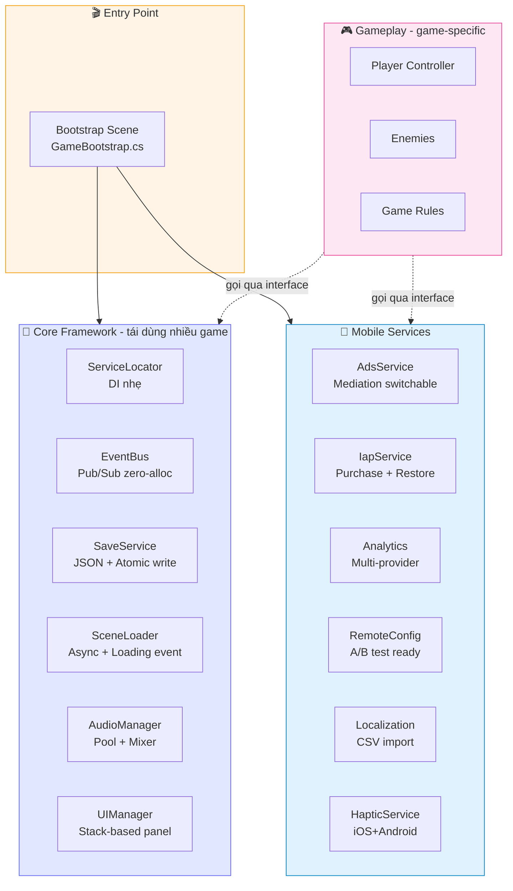

---

## 2. Bootstrap startup sequence (chi tiết)

Đây là thứ tự việc khi game khởi động. Cực kỳ quan trọng để debug "tại sao service X null":

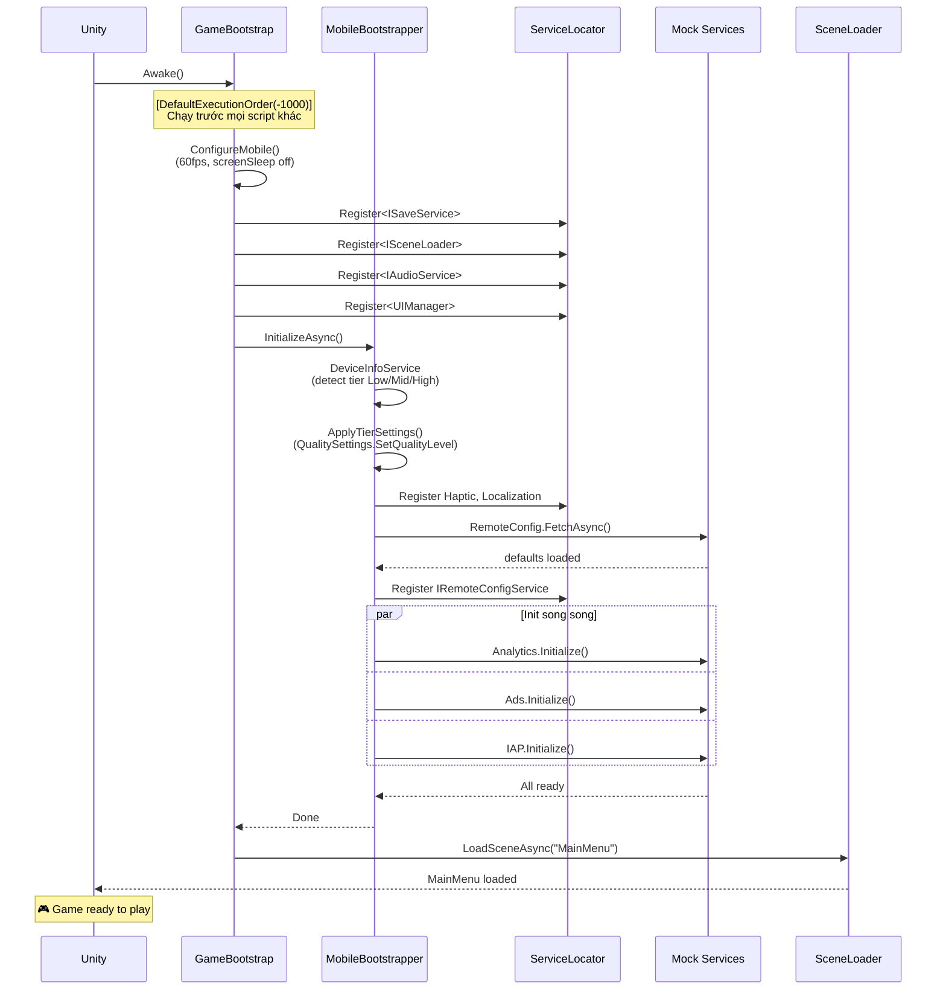

**Debug tip:** Nếu game đứng ở Bootstrap không load MainMenu → mở Console (bật ENABLE_GAME_LOG) → xem log đến chỗ nào thì dừng → biết service nào fail init.

---

## 3. Service Locator pattern

Cách các module tìm thấy nhau mà không reference trực tiếp:

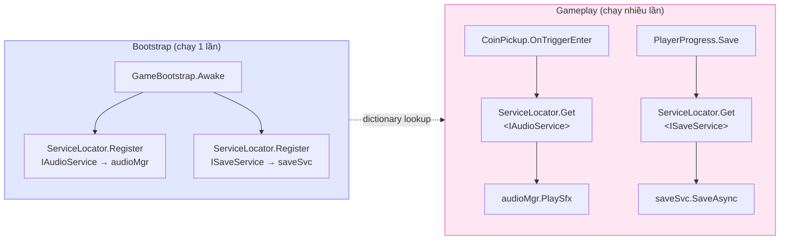

**Lợi ích:**
- Module gameplay không biết AudioManager cụ thể nào, chỉ biết `IAudioService`
- Đổi implementation (vd `AudioManager` → `FMODAudioManager`) → gameplay code không sửa
- Test dễ: register mock service trong unit test

---

## 4. Event Bus - giao tiếp giữa modules

Đây là cách module không phụ thuộc trực tiếp nhau:

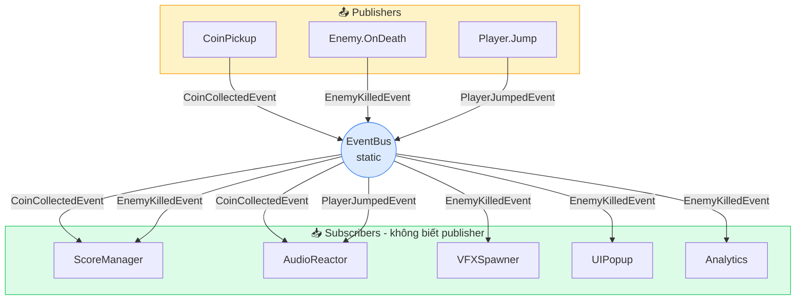

**Quy tắc:**
- 1 event = 1 struct (zero GC)
- Publisher không biết ai subscribe
- Subscriber phải `Unsubscribe` trong `OnDisable` (xem Cookbook recipe #10)

---

## 5. MVP UI pattern (RPG inventory ví dụ)

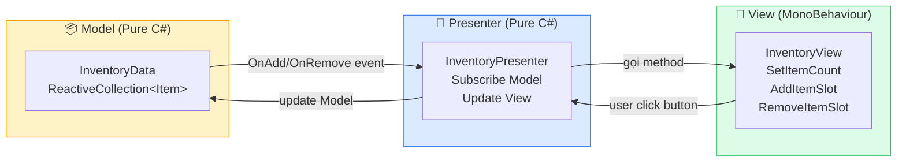

**Lợi ích:**
- **View**: chỉ biết UI component (Text, Image), không biết business logic
- **Presenter**: chứa logic, test được mà không cần Unity Editor
- **Model**: data thuần, không phụ thuộc Unity
- Designer thay UI khác hoàn toàn → Presenter không sửa

---

## 6. Factory + Pool lifecycle (spawn enemy)

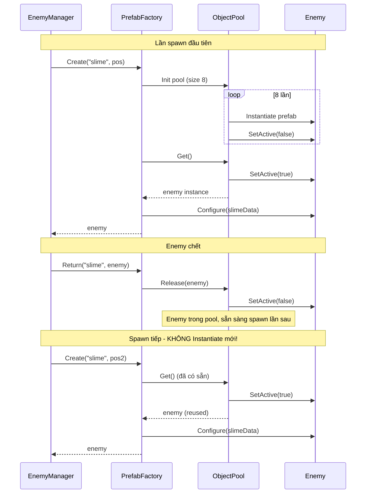

**Vì sao mobile cần pattern này:**
- `Instantiate`/`Destroy` mỗi enemy = GC spike = frame drop
- Pool reuse object → 0 alloc trong gameplay loop

---

## 7. Reactive Property data flow

Cách HP/Score tự update lên UI mà không cần gọi `UpdateUI()`:

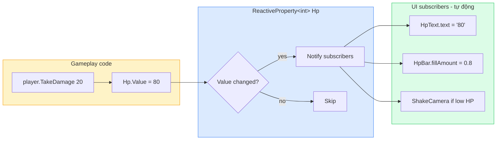

---

## 8. Mobile services - Mock vs Real SDK

Cách template build được mà không cần import SDK:

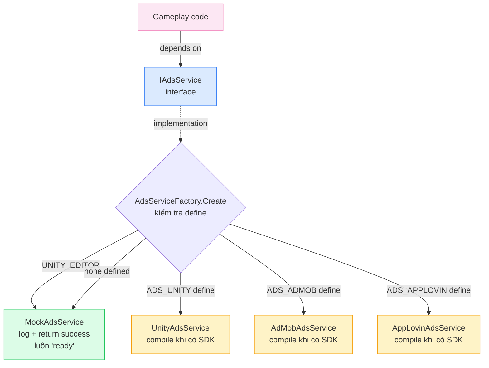

**Triết lý:** Code gameplay trước, gắn SDK cuối. Khi chưa có SDK → Mock chạy bình thường, gameplay test được hết.

---

## 9. Scene flow (game lifecycle)

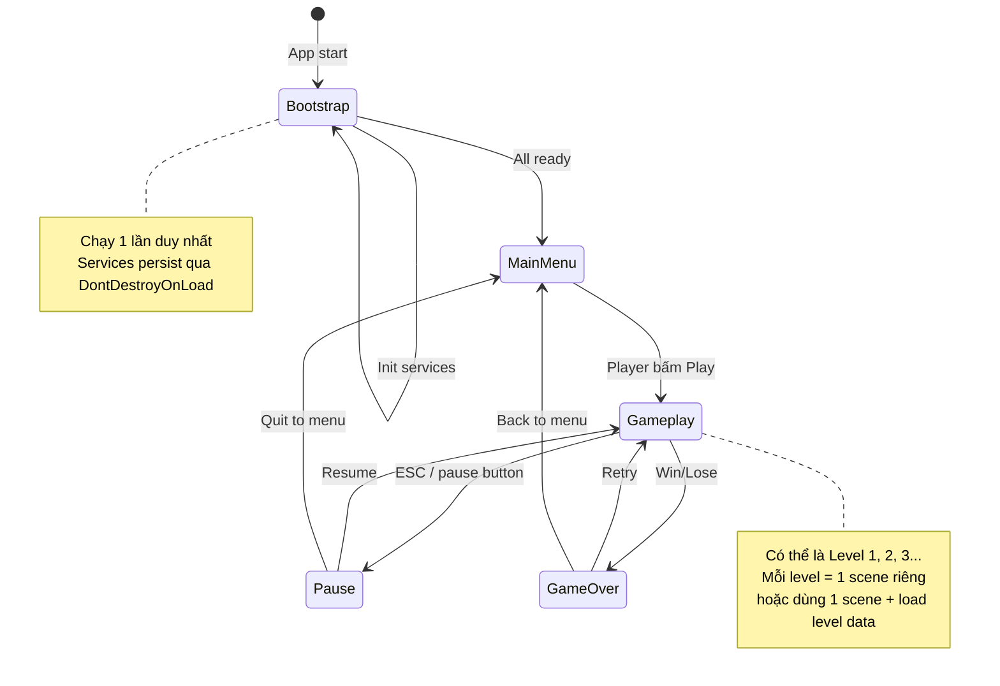

---

## 10. Folder structure ↔ Namespace mapping

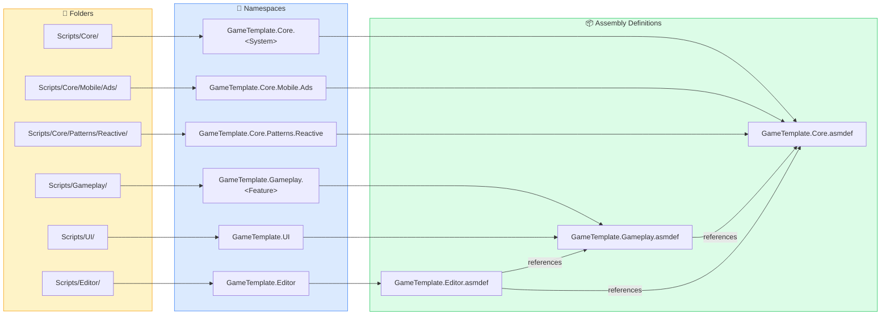

**Lợi ích Assembly Definition:**
- Sửa code Gameplay → chỉ compile Gameplay, không compile lại Core → nhanh hơn
- Ép kỷ luật: Core không reference Gameplay được → đảm bảo Core reusable

---

## 11. Adaptive Quality tier detection

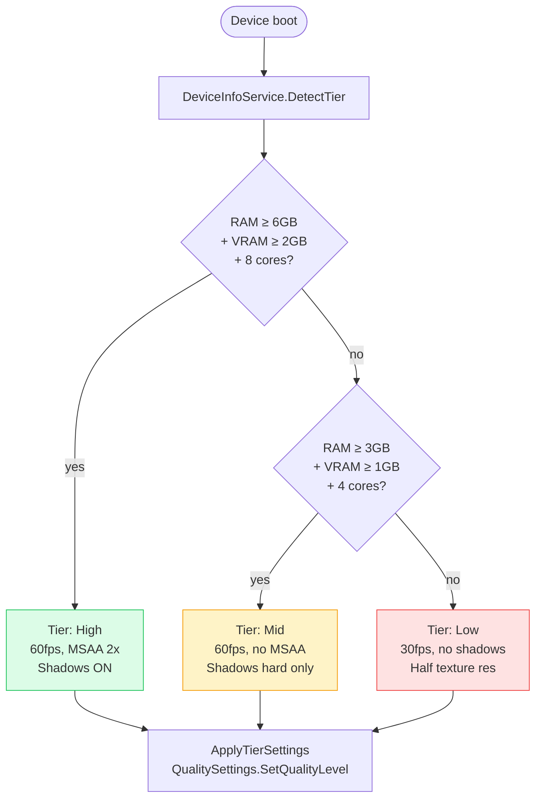

User có thể override trong Settings menu nếu muốn.

---

## Tips xem diagram trên GitHub

1. Mở repo trên GitHub → click vào file `DIAGRAMS.md`
2. GitHub tự render Mermaid → diagram hiện như ảnh
3. Click vào diagram để xem full screen
4. Edit ngay trên web: click pencil icon → sửa text → preview tab xem trước

**Nếu diagram không render:**
- GitHub support Mermaid từ 2022 - đảm bảo bạn đang trên github.com (không phải Bitbucket/legacy server)
- Nếu dùng GitLab: cũng support, từ 13.3+
- Local: cài extension VSCode "Markdown Preview Mermaid Support"
