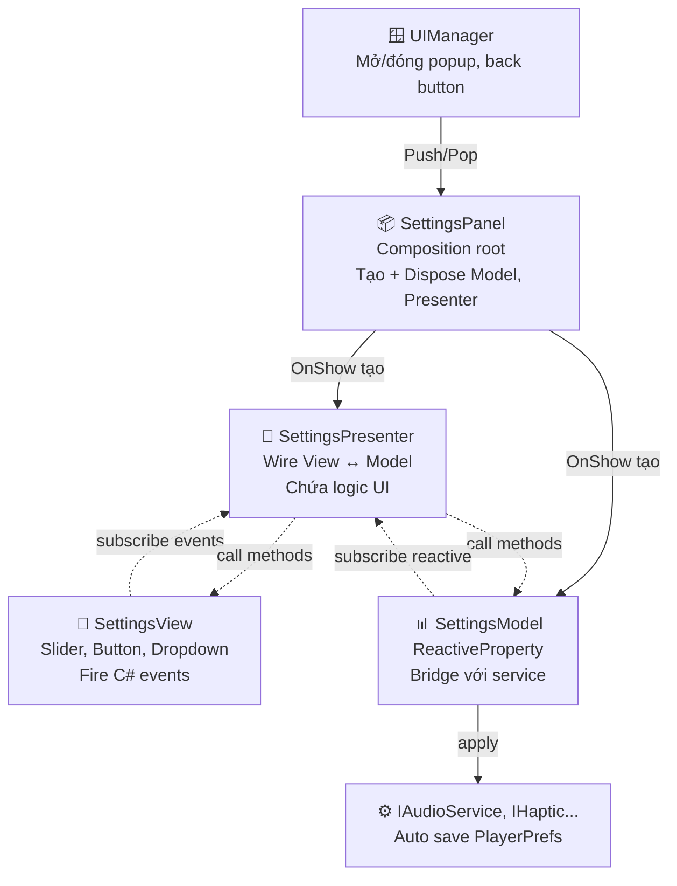
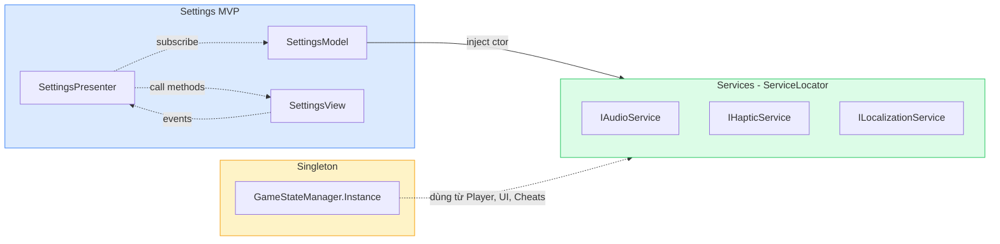

# Example: MVP + Reactive & Singleton

Hai example thực tế kết hợp patterns trong template. Đọc cùng code trong `Scripts/Gameplay/`.

## Example 1: Settings Panel (MVP + Reactive Property)

📁 `Assets/_Project/Scripts/Gameplay/UI/SettingsPanel/`

### Cấu trúc file

```
SettingsPanel/
├── SettingsModel.cs       ← Pure C#, business logic + reactive state
├── SettingsView.cs        ← MonoBehaviour, UI components only
├── SettingsPresenter.cs   ← Pure C#, wire Model ↔ View
└── SettingsPanel.cs       ← UIPanel wrapper, composition root
```

### Ai làm gì - hiểu chính xác vai trò

Nhiều dev mới đọc xong nghĩ rằng "SettingsPanel = mở/đóng popup, SettingsView = nút bấm gọi Model". **Sai 2 điểm quan trọng** - đọc kỹ phần này.

| Class | ✅ Đảm nhiệm | ❌ KHÔNG đảm nhiệm |
|---|---|---|
| **UIManager** (template có sẵn) | Mở/đóng popup, animation transition, back button Android | Logic của Settings |
| **SettingsPanel** | **Composition root**: tạo Model + Presenter khi popup hiện, dispose khi destroy | Tự mở chính nó, xử lý click button |
| **SettingsView** | Hiển thị UI component, fire C# event khi user tương tác | Gọi Model trực tiếp, chứa logic |
| **SettingsPresenter** | Subscribe View events → gọi Model, subscribe Model reactive → gọi View | Trực tiếp gọi Unity UI API |
| **SettingsModel** | ReactiveProperty cho data, bridge với service, lo persistence | Biết Unity UI có gì |

Sơ đồ ownership trực quan:



### Điểm 1: SettingsPanel KHÔNG đảm nhận mở/đóng

`SettingsPanel` kế thừa `UIPanel`. Việc **mở/đóng** thực ra là **`UIManager` làm**, không phải `SettingsPanel`. `SettingsPanel` chỉ là một panel bị quản lý.

```
Ai muốn mở Settings popup?
    ↓
ServiceLocator.Get<UIManager>().Push(settingsPanel)
    ↓
UIManager gọi settingsPanel.Show()  ← UIPanel base method
    ↓
UIPanel.Show() bật GameObject + alpha 1 + gọi OnShow()
    ↓
SettingsPanel.OnShow() được override → tạo Model + Presenter
```

`SettingsPanel` thực ra là **"composition root"** - chỉ làm 1 việc: tạo và dispose Model + Presenter đúng lúc. Animation/transition thì base class `UIPanel` lo (fade alpha).

### Điểm 2: View KHÔNG gọi Model trực tiếp

View **fire event** rồi Presenter **nghe event** rồi mới gọi Model:

```
User bấm nút Mute Music
    ↓
SettingsView nhận sự kiện Button.onClick
    ↓
SettingsView fire C# event: OnMusicMuteClicked?.Invoke()
    ↓
SettingsPresenter subscribe event này (trong OnInit)
    ↓
Presenter gọi Model.ToggleMusicMute()
    ↓
Model gọi AudioService.ToggleMusic()
    ↓
Model cập nhật ReactiveProperty.Value
    ↓
Presenter đã subscribe ReactiveProperty
    ↓
Presenter gọi View.SetMusicMuteIcon(true) → icon đổi 🔊→🔇
```

Đây là **2-way binding qua events**: View không bao giờ trực tiếp gọi Model, mà phải qua Presenter.

### Setup prefab trong Unity Editor

#### Bước 1: Tạo prefab SettingsPopup

```
Hierarchy → Right-click → UI → Panel (hoặc Empty + Image)
    Đặt tên: "SettingsPopup"

SettingsPopup (root GameObject)
├── Add Component: SettingsView    ← Script
├── Add Component: SettingsPanel   ← Script
├── Add Component: CanvasGroup     ← UIPanel base cần
│
├── Background (Image)
├── Title (Text - "Settings")
├── MusicSection
│   ├── Label
│   ├── Slider (Music Volume)
│   ├── MuteButton (Button)
│   │   └── Icon (Image)
├── SfxSection
│   ├── Label
│   ├── Slider
│   ├── MuteButton
│   │   └── Icon
├── HapticSection
│   ├── Label
│   ├── Toggle
├── LanguageSection
│   ├── Label
│   ├── Dropdown
└── CloseButton
```

#### Bước 2: Gán reference trong Inspector

**Trên `SettingsView` component:**
- Music Volume Slider: kéo `MusicSection/Slider`
- Music Mute Button: kéo `MusicSection/MuteButton`
- Music Mute Icon: kéo `MusicSection/MuteButton/Icon`
- Sfx Volume Slider, Sfx Mute Button, Sfx Mute Icon: tương tự
- Haptic Toggle: kéo `HapticSection/Toggle`
- Language Dropdown: kéo `LanguageSection/Dropdown`
- Test Sfx Clip: kéo 1 audio clip ngắn (vd tick sound) - sẽ phát khi user kéo slider SFX
- Icon Sound On / Icon Sound Off: kéo 2 sprite 🔊 và 🔇

**Trên `SettingsPanel` component:**
- View: kéo chính GameObject root (vì `SettingsView` nằm trên cùng GameObject)

#### Bước 3: Save thành prefab

Kéo `SettingsPopup` từ Hierarchy vào folder `Assets/_Project/Prefabs/UI/`.

#### Bước 4: Mở popup từ Main Menu

```csharp
public class MainMenuController : MonoBehaviour
{
    [SerializeField] private SettingsPanel _settingsPanelPrefab;
    private SettingsPanel _settingsInstance;

    public void OnSettingsButtonClicked()
    {
        // Lazy instantiate - không tạo khi mới load Main Menu
        if (_settingsInstance == null)
        {
            _settingsInstance = Instantiate(_settingsPanelPrefab, transform);
        }

        ServiceLocator.Get<UIManager>().Push(_settingsInstance);
    }
}
```

Wire `OnSettingsButtonClicked` vào nút Settings của Main Menu qua `OnClick()` trong Inspector.

### Vì sao 4 file thay vì 1?

Nếu viết tất cả trong 1 MonoBehaviour, file sẽ ~400 dòng làm:
- Read AudioService volume → set Slider value
- Slider OnValueChanged → set AudioService volume
- Read HapticService.IsEnabled → set Toggle
- Toggle OnValueChanged → set HapticService
- Dropdown populate language list
- Khi đổi ngôn ngữ, gọi 5 method UpdateLabel
- ... (40+ thứ tương tự)

Vấn đề:
- ❌ Không test được logic (vì stuck với Unity Editor)
- ❌ Đổi UI = sửa logic
- ❌ Mỗi field thêm = sửa 4 chỗ
- ❌ Loop dễ xảy ra: UI → Service → callback → UI lại set → infinite loop

### Tách MVP giải quyết thế nào

**Model** (pure C#):
- Inject service qua constructor
- Mỗi setting là `ReactiveProperty<T>` - notify khi đổi
- API rõ ràng: `SetMusicVolume()`, `ToggleSfxMute()`
- Có thể unit test bằng NUnit (mock IAudioService)

**View** (MonoBehaviour):
- Chỉ chứa `[SerializeField] Slider _slider; Button _button;`
- Method công khai: `SetMusicVolume(float)`, `SetMusicMuteIcon(bool)`
- Fire C# event khi user tương tác
- **Không biết** Model tồn tại

**Presenter** (pure C#):
- Constructor nhận `(view, model)`
- `OnInit()`: subscribe View events + Model reactive
- `OnDispose()`: unsubscribe hết
- Logic: "View OnSliderChanged → Model.SetVolume → Reactive notify → View.SetSlider"

**SettingsPanel** (MonoBehaviour, kế thừa UIPanel):
- Tạo Model + Presenter khi panel hiện ra
- Dispose khi destroy
- Tích hợp với UIManager.Push/Pop có sẵn của template

### Flow chuẩn (đọc kỹ phần này)

```
User kéo slider Music Volume
    ↓
SettingsView.onValueChanged event fire
    ↓
SettingsView.OnMusicVolumeChanged?.Invoke(0.5f)
    ↓
SettingsPresenter.OnMusicVolumeChanged(0.5f) ← subscribe View event
    ↓
Model.SetMusicVolume(0.5f)
    ↓
1. _audio.MusicVolume = 0.5f          ← AudioManager save PlayerPrefs
2. MusicVolume.Value = 0.5f           ← ReactiveProperty notify
    ↓
Mọi subscriber của MusicVolume nhận callback
    ↓
View.SetMusicVolume(0.5f) ← Presenter đã subscribe SubscribeWithInit
    ↓
slider.SetValueWithoutNotify(0.5f)  ← KHÔNG fire onValueChanged lại
```

**Điểm tinh tế:** dùng `SetValueWithoutNotify` ở View để **chặn loop**. Nếu dùng `slider.value = 0.5f` thì `onValueChanged` fire lại → vô hạn.

### Test SettingsModel không cần Unity Editor

Vì Model là pure C#, viết test NUnit bình thường:

```csharp
[Test]
public void SetMusicVolume_UpdatesAudioServiceAndNotifiesSubscribers()
{
    // Arrange: mock IAudioService
    var mockAudio = new MockAudioService { MusicVolume = 1f };
    var model = new SettingsModel(mockAudio, ..., ...);
    
    int notifyCount = 0;
    model.MusicVolume.Subscribe(_ => notifyCount++);
    
    // Act
    model.SetMusicVolume(0.5f);
    
    // Assert
    Assert.AreEqual(0.5f, mockAudio.MusicVolume);
    Assert.AreEqual(0.5f, model.MusicVolume.Value);
    Assert.AreEqual(1, notifyCount);
}
```

Test này chạy trong ~10ms, không cần Unity Editor. Logic UI test riêng - đảm bảo chất lượng.

### Tại sao Model có `SyncFromAudioService()` ?

Tình huống: user chỉnh volume **không qua SettingsPanel** (vd: từ Cheat Console gõ lệnh `audio_volume 0.3`). Service đổi nhưng UI không biết → lệch.

`AudioService.OnAudioSettingsChanged` event fire → Model.SyncFromAudioService → reactive notify → View update → UI sync với service. **Không bao giờ lệch.**

### Khi nào KHÔNG cần MVP

UI đơn giản 1-2 field hiển thị → overkill. Vd HUD chỉ hiện Score:

```csharp
// Không cần MVP - dùng MonoBehaviour + Reactive thôi
public class ScoreHud : MonoBehaviour
{
    [SerializeField] private Text _text;
    
    void OnEnable() => GameStateManager.Instance.Score.SubscribeWithInit(v => _text.text = $"Score: {v}");
    void OnDisable() => GameStateManager.Instance?.Score.Unsubscribe(...);
}
```

**Quy tắc:** UI có > 3 widget tương tác phức tạp với data → dùng MVP. Đơn giản hơn → MonoBehaviour + Reactive đủ.

---

## Example 2: GameStateManager (Singleton)

📁 `Assets/_Project/Scripts/Gameplay/Core/`

### Tại sao Singleton, không phải ServiceLocator?

Template recommend **ServiceLocator > Singleton** cho hầu hết case. Vậy khi nào Singleton?

**4 dấu hiệu nên dùng Singleton:**

1. **Truy cập từ static context**: cheat command, editor menu, attribute callback. ServiceLocator cũng được nhưng `GameStateManager.Instance` ngắn hơn.

2. **Không cần swap implementation**: GameStateManager không có interface, không ai inject mock. Lifecycle gắn chặt với Unity.

3. **Là "in-house" service**: chỉ logic game này dùng, không phải framework. Khi làm game mới, GameStateManager sẽ viết lại khác hoàn toàn.

4. **Lifecycle phụ thuộc Unity**: cần `Update()`, `OnApplicationPause()`, `Awake()` - không thể là pure C# class.

### Code GameStateManager có gì

**Setup trong Unity:** không cần kéo prefab gì. `MonoSingleton<T>.Instance` tự tạo GameObject `[Singleton] GameStateManager` khi gọi lần đầu. Nếu muốn control thứ tự init, tạo prefab và đặt sẵn trong Bootstrap scene.

```csharp
public class GameStateManager : MonoSingleton<GameStateManager>
{
    public ReactiveProperty<int> Score { get; }       // UI subscribe
    public ReactiveProperty<int> Combo { get; }
    public ReactiveProperty<float> SessionTime { get; }
    public ReactiveProperty<bool> IsPaused { get; }
    public ReactiveProperty<GameState> CurrentState { get; }
    
    public bool IsGodMode { get; set; }
    
    public void StartNewSession() { ... }
    public void EndSession(bool isWin) { ... }
    public void SetPaused(bool paused) { ... }
    public void AddScore(int amount) { ... }
}
```

Đây vẫn là **Singleton + Reactive** - 2 pattern kết hợp tự nhiên. Singleton lo "single instance + truy cập dễ", Reactive lo "notify subscribers".

### Cách dùng từ 3 nơi khác nhau

**1. Từ gameplay code (Player controller):**
```csharp
public class CoinPickup : MonoBehaviour
{
    void OnTriggerEnter(Collider other)
    {
        GameStateManager.Instance.AddScore(10);
        Destroy(gameObject);
    }
}
```

**2. Từ UI HUD (subscribe reactive):**
```csharp
public class GameplayHud : MonoBehaviour
{
    void OnEnable()
    {
        GameStateManager.Instance.Score.SubscribeWithInit(s => _scoreText.text = s.ToString());
    }
}
```

**3. Từ Cheat Console (static method):**
```csharp
public static class GameplayCheats
{
    [CheatCommand("add_score", "add_score <amount>")]
    static void AddScore(string[] args)
    {
        GameStateManager.Instance.AddScore(int.Parse(args[0]));
    }
}
```

**Đây là chỗ Singleton thắng ServiceLocator:** từ static method, viết `GameStateManager.Instance` ngắn hơn `ServiceLocator.Get<IGameStateManager>()`. Cheat console có 20-30 command - chênh lệch code này tích lại đáng kể.

### Quy tắc dùng Singleton không bị spaghetti

**1. Không hơn 3 Singleton trong project.** Mỗi cái thêm = 1 điểm coupling. Project mình tóm:
- `GameStateManager` - session state
- `Player.Instance` (nếu có) - player local
- Hết.

**2. Không inject Singleton vào constructor.** Class nhận Singleton qua constructor = lừa người đọc. Constructor chỉ nên nhận interface (ServiceLocator).

**3. Static state PHẢI reset khi reload game.** MonoSingleton trong template handle sẵn (`OnDestroy` clear instance). Đừng để state cũ dính qua session mới.

**4. Test Singleton bằng test scene riêng.** Không unit test được - chấp nhận. Bù lại: integration test hoặc PlayMode test trong Unity.

### Cảnh báo anti-pattern thường gặp

❌ **Singleton hell** - mọi class đều là Singleton:
```csharp
PlayerManager.Instance.SetPosition(...)
AudioManager.Instance.PlaySfx(...)
ScoreManager.Instance.Add(...)
ParticleManager.Instance.Spawn(...)
NetworkManager.Instance.Send(...)
// → mọi thứ couple với mọi thứ. Test khó. Refactor khó.
```

✅ **Service Locator cho framework, Singleton cho game state:**
```csharp
// Framework - swap được, mock được
ServiceLocator.Get<IAudioService>().PlaySfx(...);

// Game state - truy cập tiện
GameStateManager.Instance.AddScore(...);
```

---

## Kết hợp 2 pattern: ai biết ai?



**Layering rõ:**
- Services (ServiceLocator) là **lớp dưới cùng** - không biết ai dùng mình
- Singleton (GameStateManager) là **lớp giữa** - dùng services, được UI dùng
- MVP (Settings) là **lớp trên cùng** - dùng services qua Model, UI tương tác qua View

Không có vòng tròn dependency. Code mới scale lên dễ.

---

## Test thử trên Editor

1. Vào Bootstrap → load Gameplay scene
2. Mở Cheat Console (Tab) → gõ `god_mode` → bật
3. Gõ `add_score 100` → HUD hiện "Score: 1000" (god_mode x10)
4. Gõ `session_info` → in ra state đầy đủ
5. Mở Settings Panel → kéo slider Music → AudioMixer giảm volume realtime
6. Đóng panel → mở lại → slider nhớ giá trị (PlayerPrefs persist)
7. Đổi ngôn ngữ → mọi label trong panel refresh

## Khi nào team mới copy pattern này

| Bài toán | Copy example nào |
|---|---|
| Settings, Profile, Inventory chi tiết | **MVP + Reactive** (Example 1) |
| HUD đơn giản (score, hp, time) | **Singleton + Reactive trực tiếp** (Example 2) |
| Shop, Quest log, Character sheet | **MVP + Reactive** |
| Achievement progress | **Reactive + MonoBehaviour** đủ |
| Cheat commands gameplay | **Singleton + static class** |
| Network/Multiplayer state | **ServiceLocator** (cần swap mock/real) |
| Save/Load | **ServiceLocator** (đã có ISaveService) |
